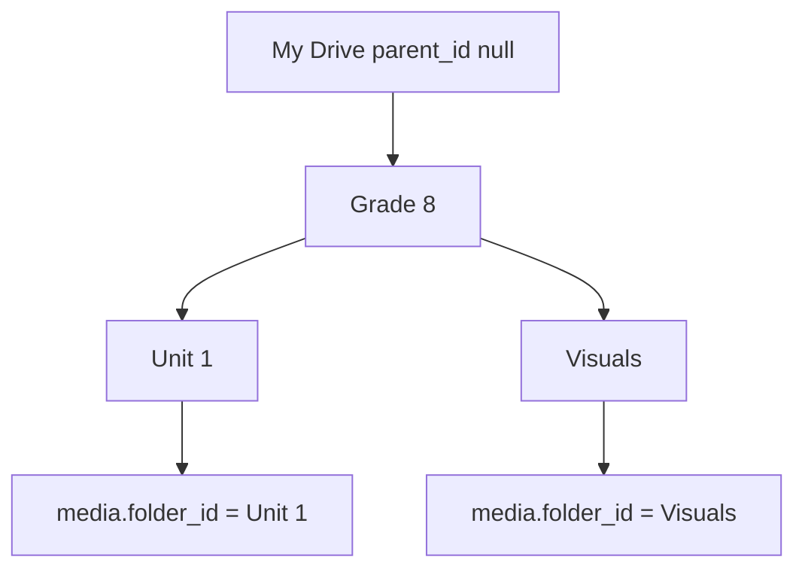

# DB schema (Eraser)

Pasteable into [eraser.io](https://eraser.io). Updated for **nested Media Library folders** (Drive-style) and aligned with the teacher mock / architecture notes.

**Conventions**
- `parent_id = null` → root (“My Drive”); files never live at root (`media.folder_id` required).
- Lookup tables (`grades`, `curriculums`, `backgrounds`, `image_styles`) are dropdown catalogs — stored as strings on classes/identities, not FKs.
- Binaries (files, logos, lesson JSON) live in object storage; Postgres holds URLs + metadata.
- Prefer `ON DELETE RESTRICT` for folder → child folders and folder → media (refuse delete if non-empty).

```
organizations[]{
  id string pk
  name string
  domains string[] unique
  created_at datetime
  updated_at datetime
}

users[]{
  id string pk
  name string
  email string unique
  password_hash string
  role string
  organization_id string fk
  created_at datetime
  updated_at datetime
}

media_folders[]{
  id string pk
  organization_id string fk
  parent_id string fk nullable
  name string
  slug string
  created_by string fk
  created_at datetime
  updated_at datetime
}

media[]{
  id string pk
  organization_id string fk
  folder_id string fk
  uploaded_by string fk
  status string
  description text
  summary text
  file_name string
  file_url string
  mime_type string
  file_size integer
  pages_number integer nullable
  error text nullable
  created_at datetime
  updated_at datetime
}

grades[]{
  id string pk
  name string
}

curriculums[]{
  id string pk
  name string
}

backgrounds[]{
  id string pk
  name string
}

image_styles[]{
  id string pk
  name string
}

fonts[]{
  id string pk
  name string
  url string
}

classes[]{
  id string pk
  organization_id string fk
  name string
  grade string
  curriculum string
  description string
  created_at datetime
  updated_at datetime
}

identities[]{
  id string pk
  organization_id string fk
  name string
  primary_color string
  secondary_color string
  background string
  image_style string
  typography string fk
  instructions text
  logo string
  is_default boolean
  created_at datetime
  updated_at datetime
}

lessons[]{
  id string pk
  organization_id string fk
  title string
  created_by string fk
  class_id string fk
  identity_id string fk nullable
  status string
  json_url string nullable
  plan_payload jsonb nullable
  created_at datetime
  updated_at datetime
}

lesson_messages[]{
  id string pk
  lesson_id string fk
  role string
  content text
  meta jsonb nullable
  created_at datetime
}

lesson_preferences[]{
  lesson_id string pk
  identity_id string fk nullable
  class_id string fk nullable
  topic string
  duration string
  learning_styles string[]
  language string
  grade_hint string
  extra jsonb nullable
  updated_at datetime
}

lesson_media[]{
  lesson_id string fk
  media_id string fk
}

users.organization_id > organizations.id

media_folders.organization_id > organizations.id
media_folders.parent_id > media_folders.id
media_folders.created_by > users.id

media.organization_id > organizations.id
media.folder_id > media_folders.id
media.uploaded_by > users.id

classes.organization_id > organizations.id

identities.organization_id > organizations.id
identities.typography > fonts.id

lessons.organization_id > organizations.id
lessons.created_by > users.id
lessons.class_id > classes.id
lessons.identity_id > identities.id

lesson_messages.lesson_id > lessons.id

lesson_preferences.lesson_id > lessons.id
lesson_preferences.identity_id > identities.id
lesson_preferences.class_id > classes.id

lesson_media.lesson_id > lessons.id
lesson_media.media_id > media.id
```

## Nested folders

| Concept | Rule |
|---------|------|
| Root | `media_folders.parent_id IS NULL` |
| Children | `WHERE parent_id = :folder_id` |
| Breadcrumbs | Walk `parent_id` until `NULL` |
| Upload | Always into a folder (`media.folder_id NOT NULL`) — no files at root |
| Unique slug | Prefer `UNIQUE (organization_id, parent_id, slug)` (same name OK under different parents) |
| Cycles | App must reject moves that would make a folder an ancestor of itself |
| Delete | Block if child folders or media exist (mock behavior) |



## Media status enum

| Value | Meaning |
|-------|---------|
| `uploading` | Upload in progress |
| `processing` | Describer / indexing job |
| `indexed` | Ready for lesson use (≈ `ready`) |
| `failed` | Processing failed (`error` set) |

## Lesson status enum

| Value | Meaning |
|-------|---------|
| `chatting` | Gathering requirements |
| `awaiting_plan_approval` | Continue chat or make plan |
| `planning` | Plan creation in progress |
| `awaiting_execute_approval` | Plan done; wait to build slides |
| `slides_in_progress` | Slides generating |
| `slides_ready` | Slides + lesson JSON done |
| `failed` | Error |

## Notes vs older flat schema

- Added `media_folders.parent_id` (self-FK, nullable) for Drive-style nesting.
- Added `organization_id` on tenant-owned tables (folders, media, classes, identities, lessons).
- Renamed `password` → `password_hash`; `createdBy` → `created_by`; `class` / `identity` → `class_id` / `identity_id`; fixed `prefrences` / `instrations`.
- Split lesson `preferences jsonb[]` into `lesson_preferences` + `lesson_messages` + `lesson_media` (matches architecture).
- Added media `status`, `summary`, `error`; optional `pages_number` for multi-page docs.
