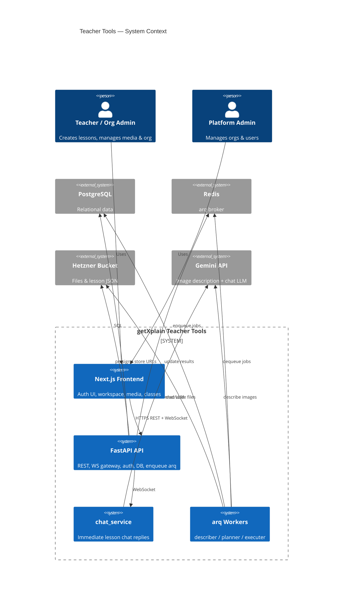
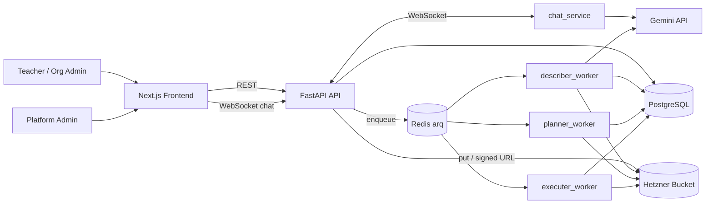
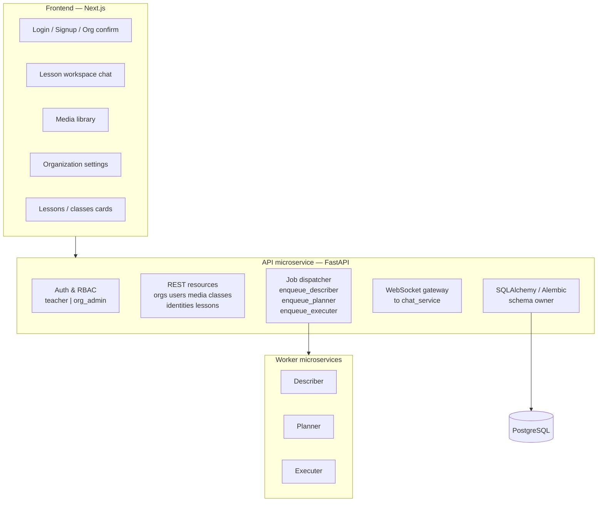
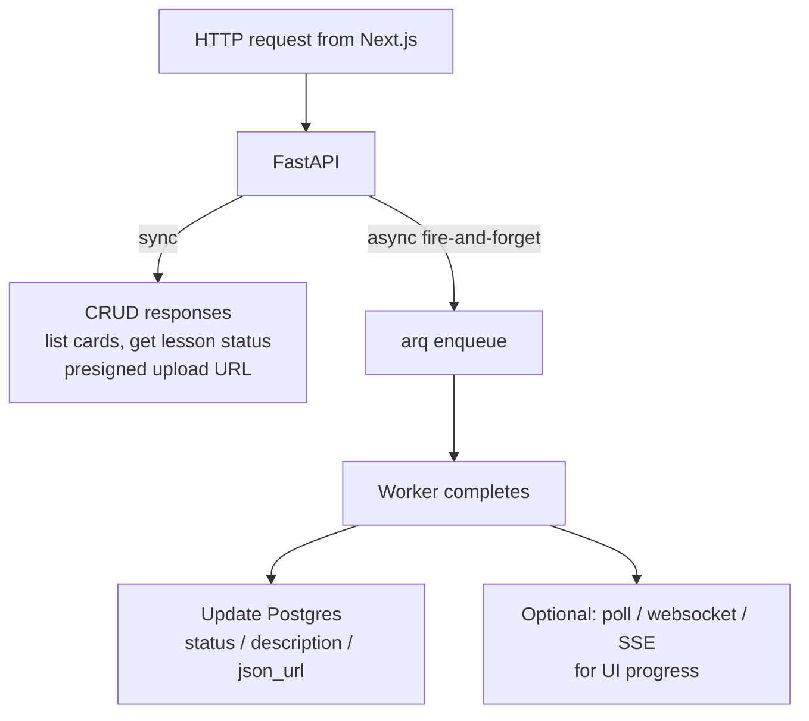
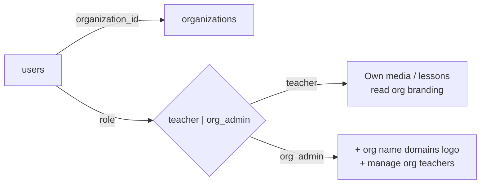
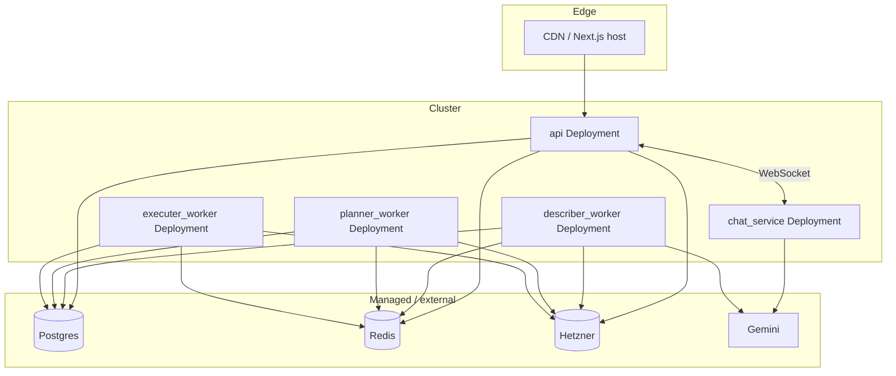

# 01 — System overview

## Context

Teachers create lessons from uploaded sources. The Next.js app talks to the FastAPI **API** over REST and **WebSocket** (chat). The API persists metadata in Postgres, stores binaries in Hetzner, proxies live chat to **`chat_service`**, and enqueues slow work via **arq**: **describer**, **planner**, **executer**.

Media is described **before** chat. Chat is real-time; plan/slides stay async.

## High-level architecture

> If your Mermaid renderer does not support C4, use the flowchart below instead.

## Service map

## Sync vs async boundary

## Auth & tenancy (logical)

## Deployment sketch (optional)

