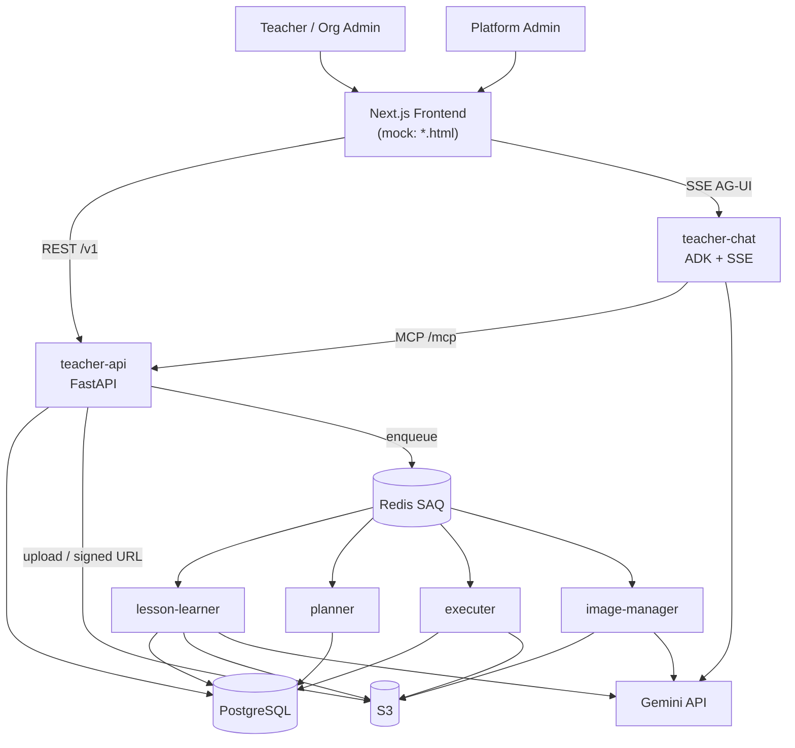
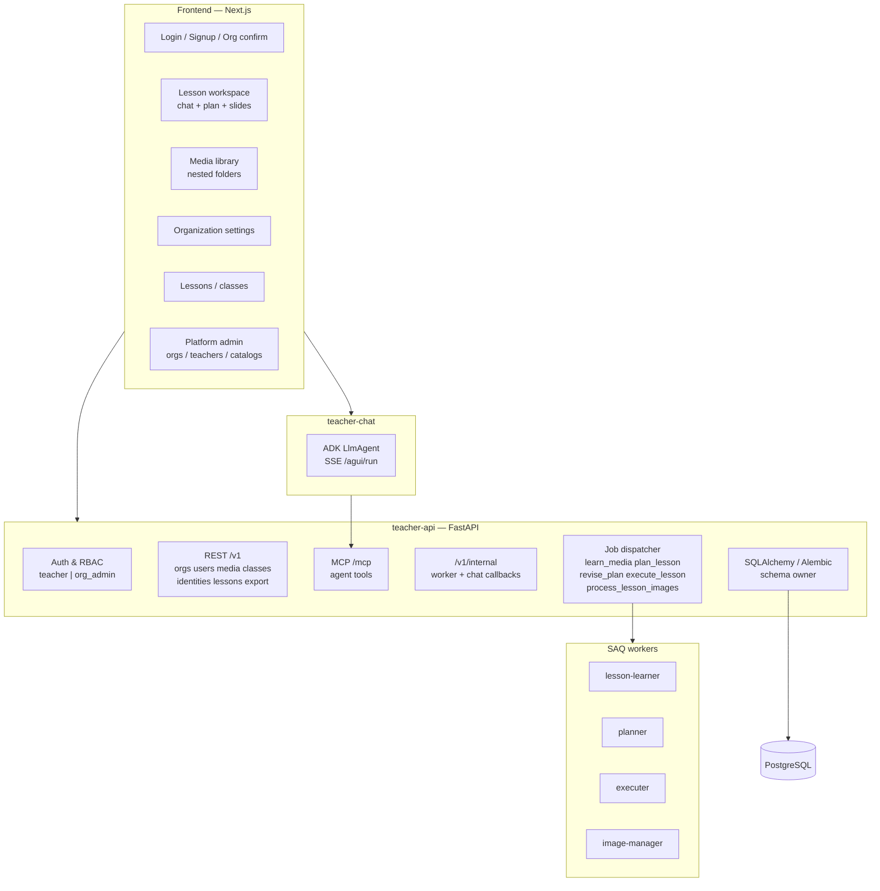
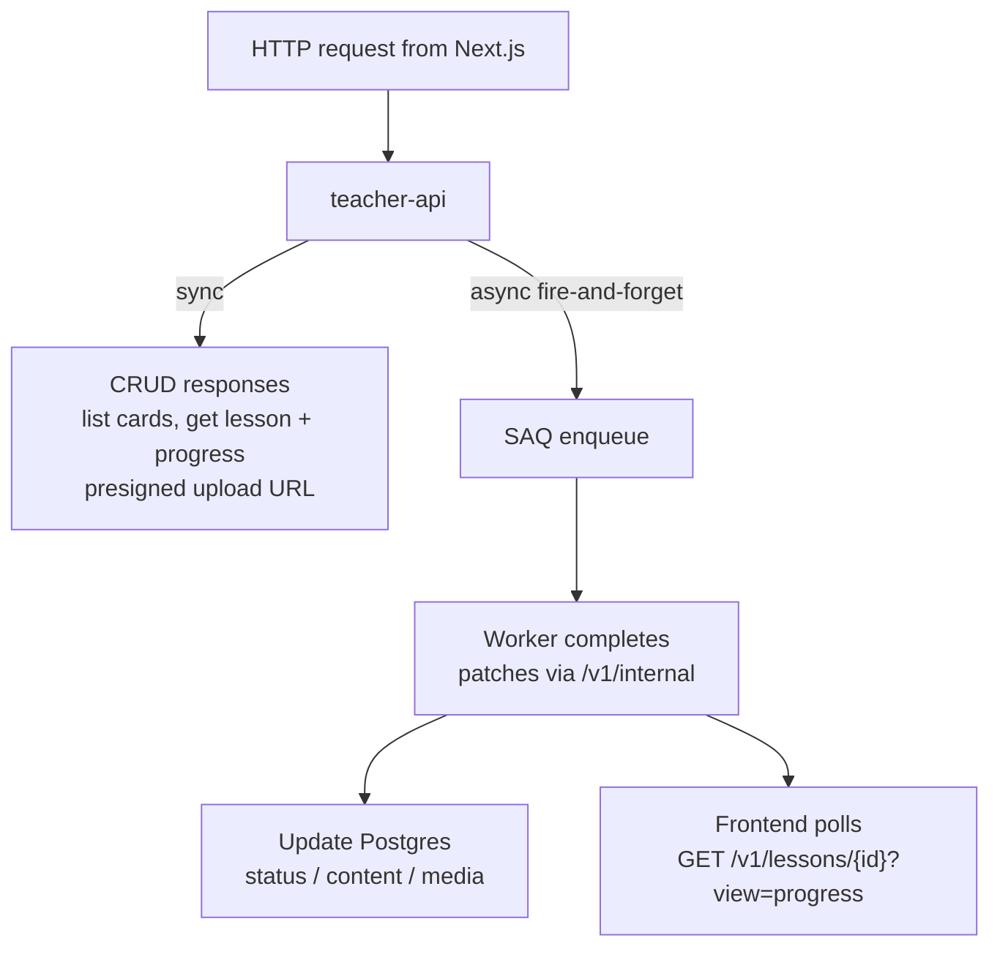
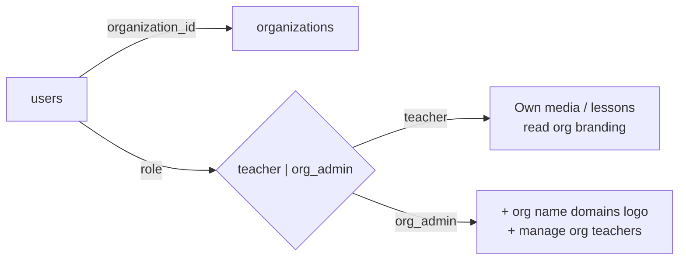
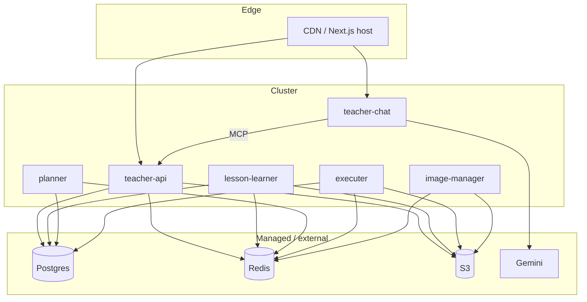

# 01 — System overview

## Context

Teachers create lessons from uploaded sources. The **Next.js** frontend talks to **teacher-api** over REST (`/v1/*`) and to **teacher-chat** over **SSE** (AG-UI). The API persists metadata in Postgres (`lessons.content` JSONB is canonical), stores binaries in **S3**, exposes **MCP tools** for the chat agent, and enqueues slow work via **SAQ**: **lesson-learner**, **planner**, **executer**, **image-manager**.

Media is indexed **before** chat. Chat streams in real time; plan/slides stay async.

> **UI mock:** This repo (`teacher-mock/`) is a static HTML prototype that mirrors the UX. See [README](README.md#ui-mock-in-this-repo) for the file map. Browse [`system_overview.html`](../../system_overview.html) for a rendered overview.

## High-level architecture

## Service map

## Sync vs async boundary

Chat is **not** on this diagram — it uses **SSE** directly to teacher-chat (see [06-chat-service.md](06-chat-service.md)).

## Auth & tenancy (logical)

Platform admins are a separate scope (mock: `admin/*.html`; production: platform routes).

## Mock ↔ production mapping

| Area | Production | Mock (`teacher-mock/`) |
|------|------------|------------------------|
| App shell | Next.js App Router | `js/layout.js` + `#app-shell` |
| State | PostgreSQL | `js/store.js` → `localStorage` |
| Chat | SSE + ADK + MCP | `js/chat.js` scripted steps |
| Media index | `lesson-learner` queue | `js/media.js` timers |
| Plan / slides | planner + executer queues | `js/workspace.js` timers |
| Session phases | `lessons.status` enum | `session.phase` + `agent_step` |
| Media folders | `media_folders.parent_id` | `folders[]` in seed |
| Platform admin | Separate deployment | `admin/` pages |

### Mock session phases (workspace)

| `session.phase` | UX |
|-----------------|-----|
| `intake` | Chat gathering (topic → sources → identity → details) |
| `generating_plan` | Progressive plan cards |
| `planning` | Plan ready; pencil edits |
| `building` | Slide placeholders → ready HTML |
| `ready` | View / export lesson |

## Deployment sketch

