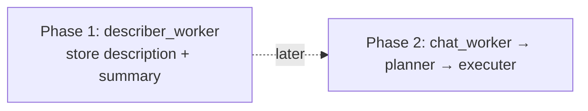
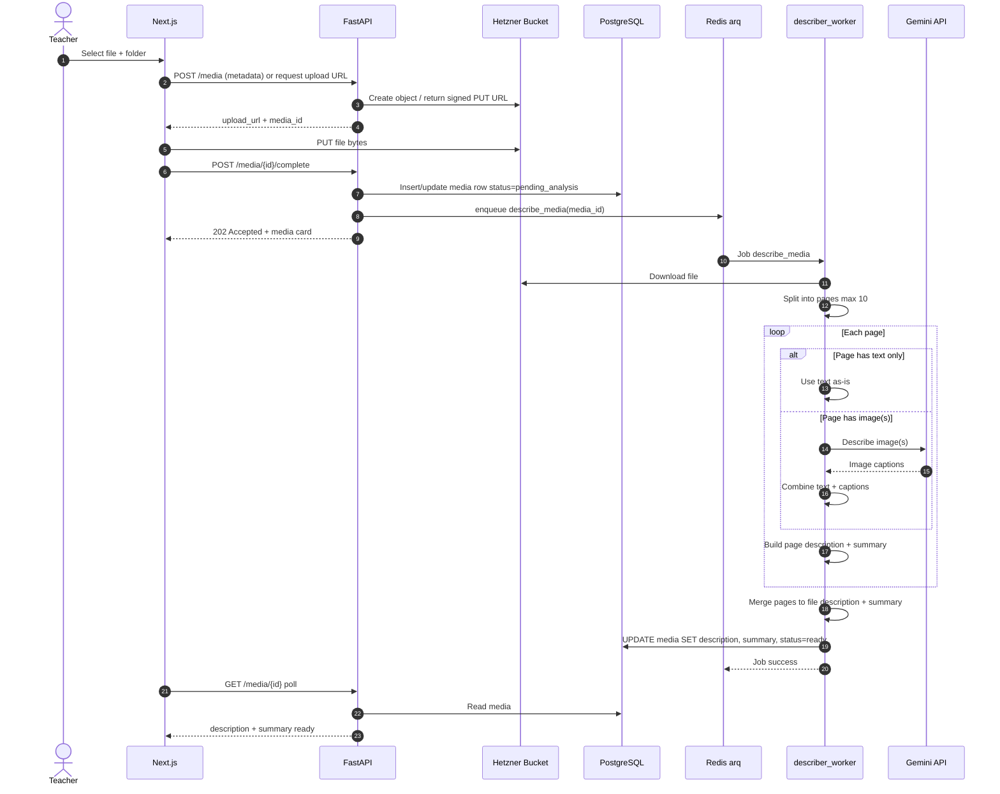
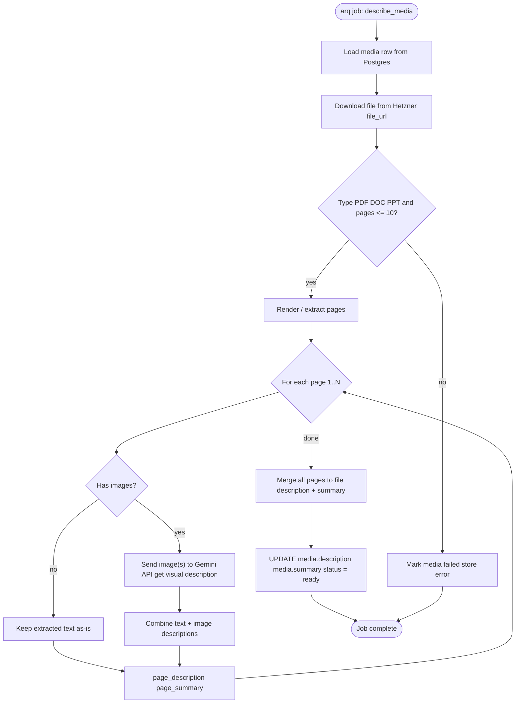
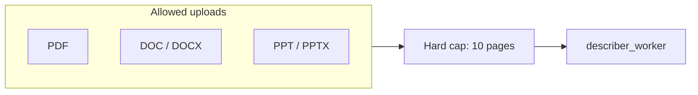
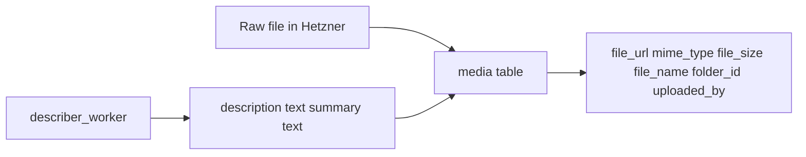
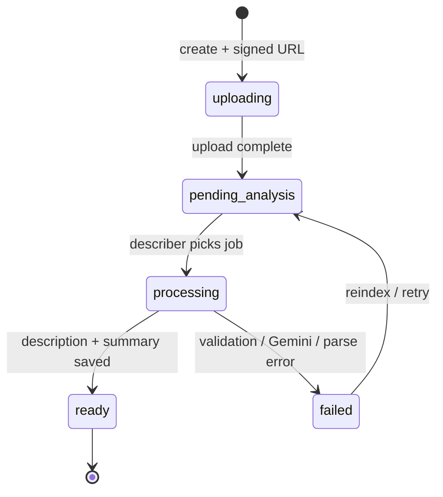

# 02 — Media upload & describer_worker

## Goal

Upload a source file (PDF / DOC / PPT, **max 10 pages**), store the binary in **Hetzner**, then run **describer_worker** to produce:

- per-page **description** + **summary**
- merged file-level **description** + **summary** written to `media.description` / `media.summary`

Images on a page are sent to **Gemini** for description. Pure text is taken as-is.

## Independent of chat (important)

This runs in the **Media Library** on upload/reindex only. It is **not** part of chat.

Chat (`chat_worker`) and planning later only **read** stored `media.description` / `media.summary`.

## Describer internal pipeline

## Supported inputs

## Data written

## Status lifecycle (media)

