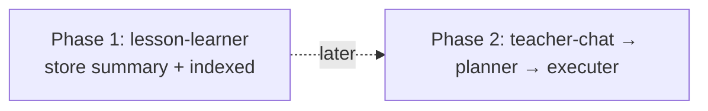
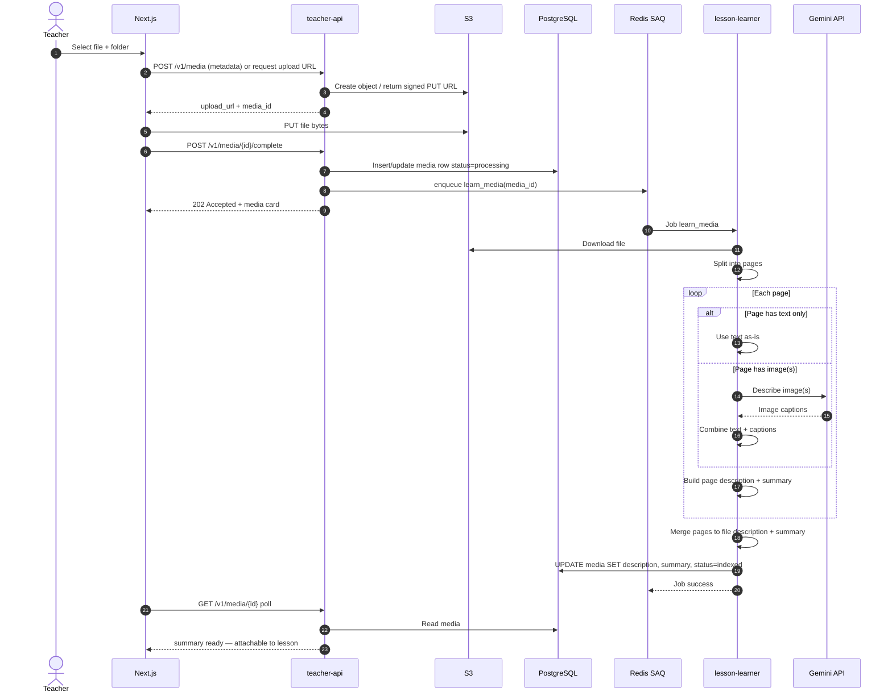
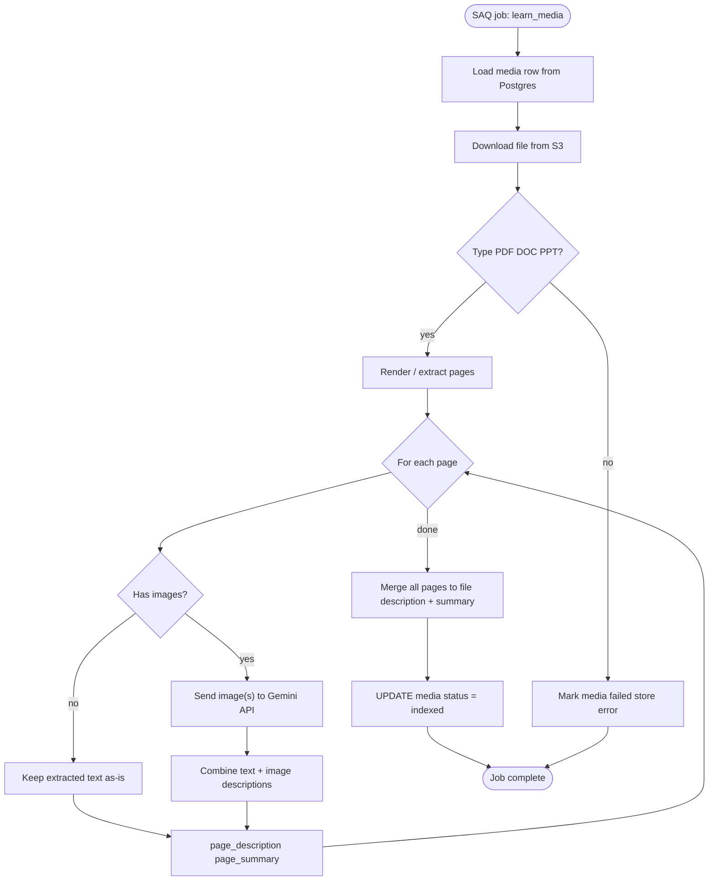
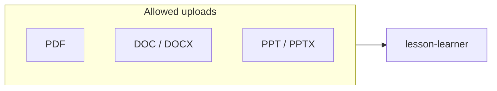
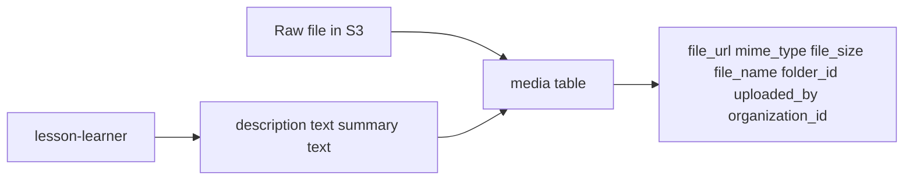
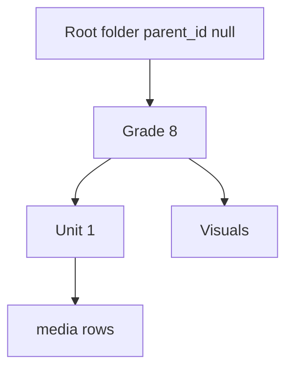
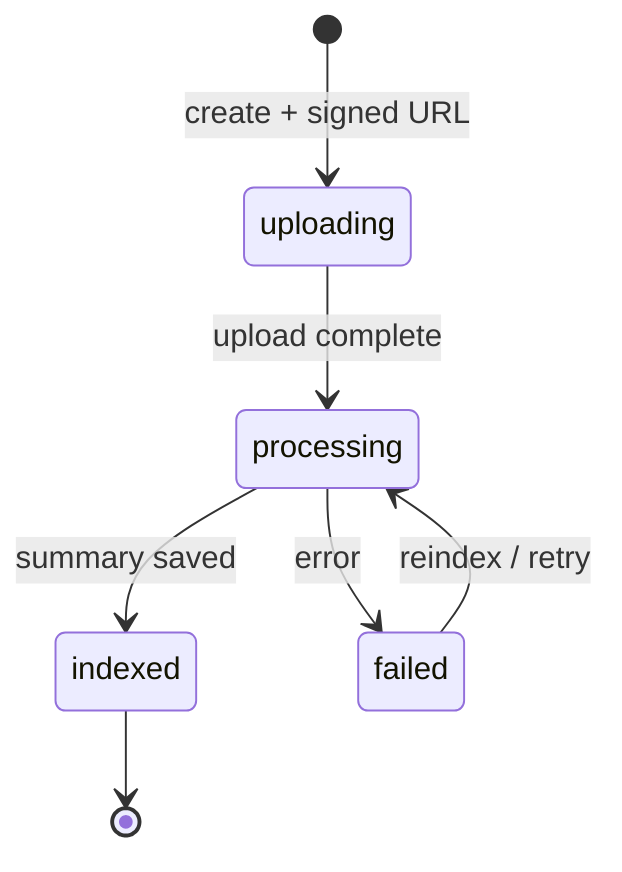

# 02 — Media upload & lesson-learner

> **Naming:** Production service is **lesson-learner** (`learn_media` job). Older docs called this `describer_worker`.

## Goal

Upload a source file (PDF / DOC / PPT), store the binary in **S3**, then run **lesson-learner** to produce:

- per-page **description** + **summary**
- merged file-level **description** + **summary** on the `media` row
- `status=indexed` when ready for lesson attachment

Images on a page are sent to **Gemini** for description. Pure text is taken as-is.

## Independent of chat (important)

This runs in the **Media Library** on upload/reindex only. It is **not** part of chat.

Chat and planning later only **read** stored `media.summary` / `media.description`.

## Lesson-learner internal pipeline

## Supported inputs

## Data written

## Nested folders (Media Library)

Files always live inside a folder (`media.folder_id NOT NULL`). Folders support `parent_id` for Drive-style nesting.

See [04-database.md](04-database.md) and `db-schema-eraser.md` in repo root.

## Status lifecycle (media)

| Mock status | Production status | Meaning |
|-------------|-------------------|---------|
| `uploading` | `uploading` | Upload in progress |
| `processing` | `processing` | Indexing job running |
| `indexed` | `indexed` | Ready for lesson use |
| `failed` | `failed` | Validation / parse / Gemini error |

## Mock implementation

`js/media.js` simulates indexing with timers:

1. Upload → `status=uploading`
2. After delay → `status=processing`
3. After delay → `status=indexed` (or `failed`)

Only `indexed` media appears in `js/media-picker.js` for lesson attachment.
