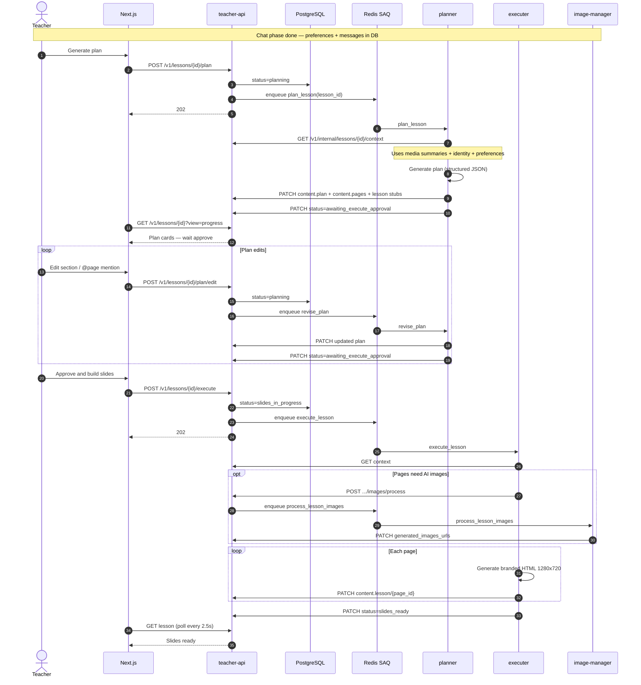
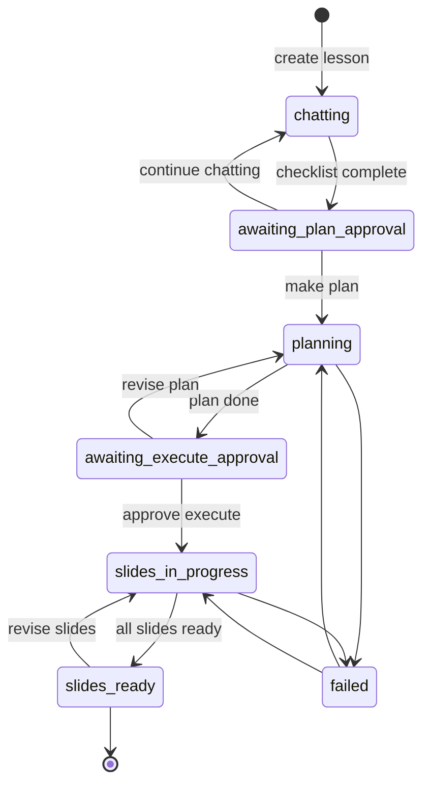
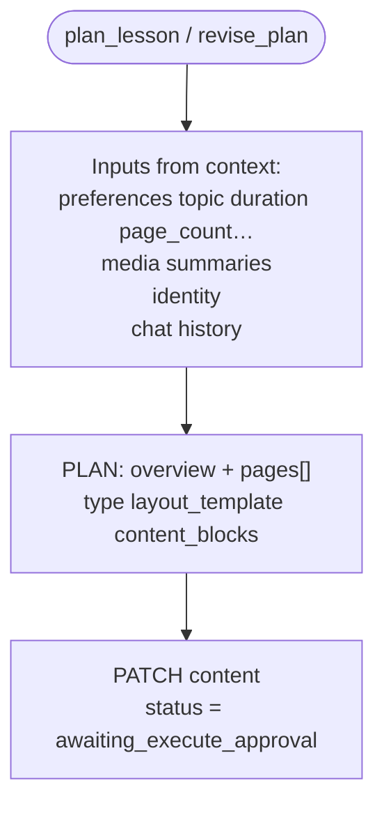
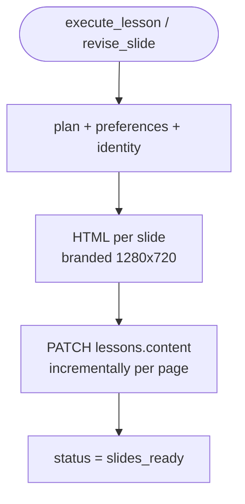
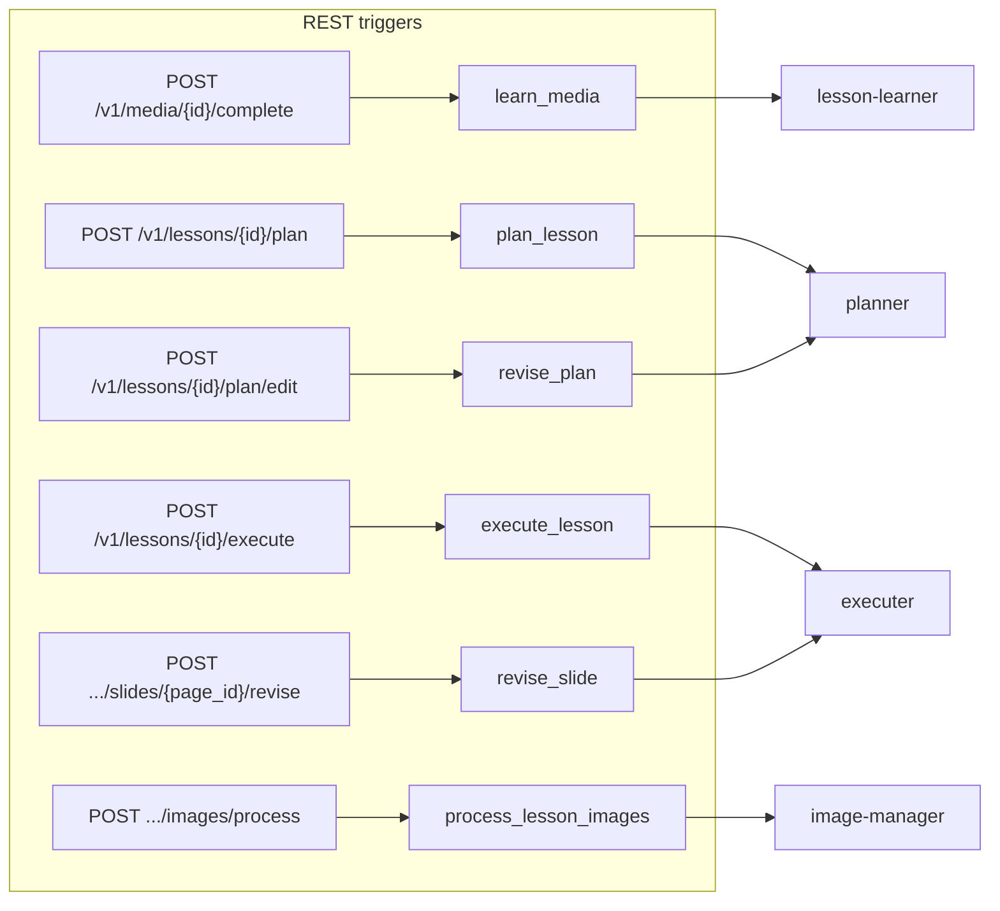

# 03 — Lesson planner & executer flows

## Goal

1. **planner** — after chat confirms **make plan**, build the slide **plan** from stored media summaries + **lesson preferences**; accept plan edits until teacher approves execute.
2. **executer** — generate **HTML slides** and patch `lessons.content` incrementally (plan, pages, lesson arrays).
3. **image-manager** — generate AI images for pages where `image_needed=true` and no teacher upload exists.

Chat itself is owned by [`teacher-chat`](06-chat-service.md) over **SSE** (not SAQ). Media indexing is Phase 1 only ([02](02-media-describer-flow.md)).

## Prerequisite

- Media already has `status=indexed` with summary/description.
- Chat has filled `lesson_preferences` and lesson reached `awaiting_plan_approval` → user chose **make plan**.

## End-to-end (after chat)

## Lesson status state machine

| Status | Owner | UI (mock) |
|--------|-------|-----------|
| `chatting` | teacher-chat (SSE) | Chat panel |
| `awaiting_plan_approval` | teacher-chat / API | Continue vs Create Lesson Plan |
| `planning` | planner | Progressive plan cards |
| `awaiting_execute_approval` | API / teacher | Plan cards + Approve & Execute |
| `slides_in_progress` | executer + image-manager | Building slides |
| `slides_ready` | — | View / export lesson |
| `failed` | — | Retry |

## planner

**Page types:** `explain` | `assessment` | `group_work` | `pair_work`

**Layout templates:** `title_hero` | `split_image` | `two_column` | `timeline` | `quote_focus` | `assessment_cards` | `full_bleed_visual`

## executer + lesson content

Canonical JSON shape: **[07-lesson-json-schema.md](07-lesson-json-schema.md)**.

- **`pages[].plan`** = pedagogical outline (planner writes)
- **`lesson[].html`** = rendered HTML (executer writes)
- Identity/preferences stay in Postgres — not root fields in content JSON

## How API fires queues

> Chat messages travel on **SSE** (see [06](06-chat-service.md)), not through this queue diagram.

## Mock implementation

`js/workspace.js` + `js/chat.js`:

- **Create Lesson Plan** → `phase=generating_plan` → progressive plan cards (`plan_gen`)
- **Approve & Execute** → `phase=building` → slide placeholders fill in with timers
- **Export** → mock PDF/PPTX download toast
