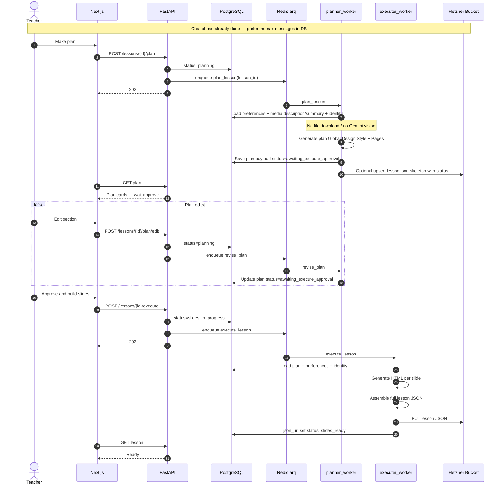
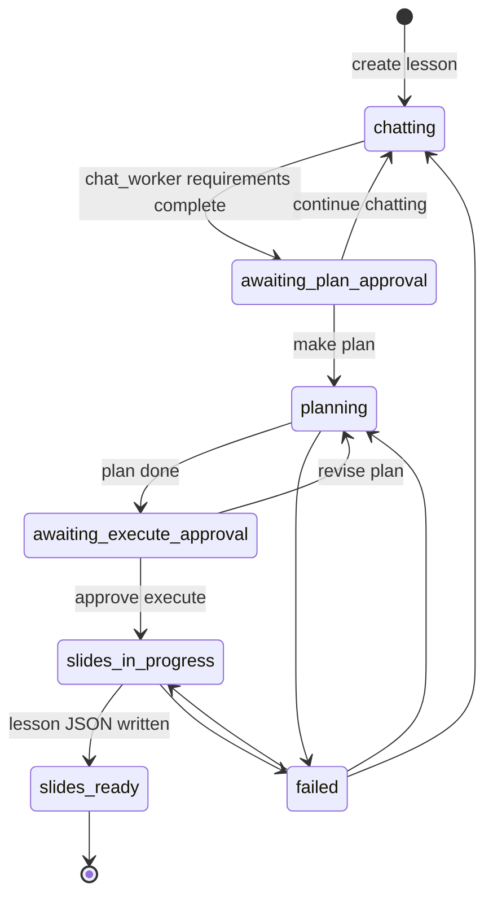
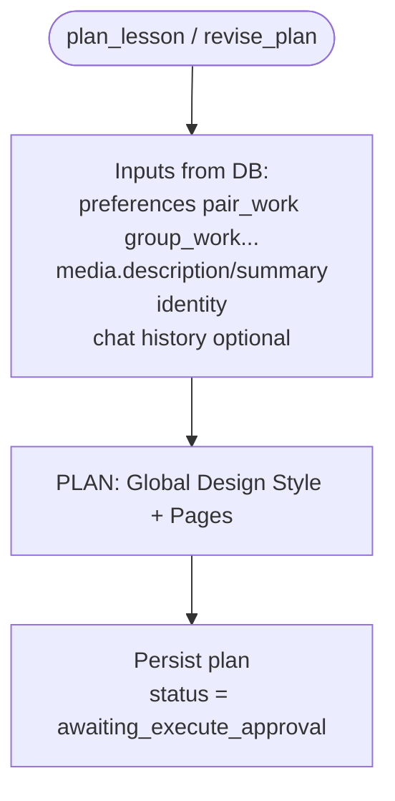
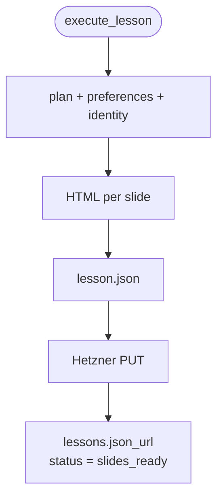
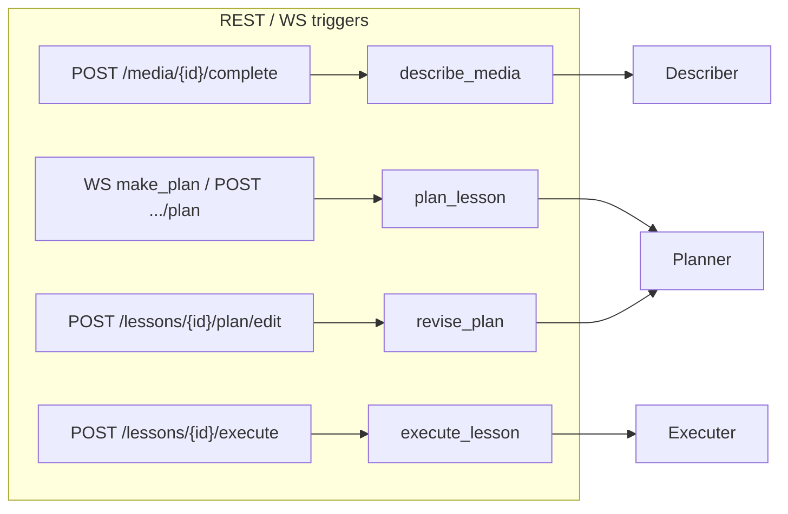

# 03 — Lesson planner & executer flows

## Goal

1. **planner_worker** — after chat confirms **make plan**, build the slide **PLAN** from stored media text + **lesson preferences**; accept plan edits until teacher approves execute.
2. **executer_worker** — generate **HTML slides** and write **lesson JSON** (title, status, identity, preferences, slides) to Hetzner.

Chat itself is owned by [`chat_service`](06-chat-service.md) over **WebSockets** (not arq). Media describing is Phase 1 only ([02](02-media-describer-flow.md)).

## Prerequisite

- Media already has `description` + `summary`.
- Chat has filled `lesson_preferences` and lesson reached `awaiting_plan_approval` → user chose **make plan**.

## End-to-end (after chat)



## Lesson status state machine



| Status | Owner | UI |
|--------|-------|-----|
| `chatting` | chat_service (WS) | Chat panel |
| `awaiting_plan_approval` | chat_service / API | Continue vs Make plan |
| `planning` | planner_worker | Progress |
| `awaiting_execute_approval` | API / teacher | Plan cards + Approve |
| `slides_in_progress` | executer_worker | Building slides |
| `slides_ready` | — | View / export lesson |
| `failed` | — | Retry |

## planner_worker



## executer_worker + lesson JSON



### `lesson.json` shape (bucket)

```json
{
  "title": "Photosynthesis for Grade 8",
  "status": "slides_ready",
  "identity": {
    "id": "...",
    "name": "...",
    "primary_color": "#7B4DFF",
    "secondary_color": "#F5A623",
    "background": "simple_white",
    "image_style": "realistic",
    "typography": "...",
    "instructions": "...",
    "logo_url": "https://..."
  },
  "preferences": {
    "class_id": "...",
    "media_ids": ["..."],
    "topic": "...",
    "duration": "45m",
    "learning_styles": ["visual", "kinesthetic"],
    "pair_work": true,
    "group_work": false,
    "assessment": "exit_ticket",
    "language": "en",
    "grade_hint": "Grade 8"
  },
  "plan": { },
  "slides": [
    { "index": 1, "title": "...", "html": "<section>...</section>" }
  ]
}
```

`status` inside the JSON should track the same enum as `lessons.status` (updated as the lesson progresses; executer writes the final `slides_ready` artifact, earlier stages may write a partial JSON if desired).

## How API fires queues



> Chat messages travel on WebSockets (see [06](06-chat-service.md)), not through this queue diagram.
