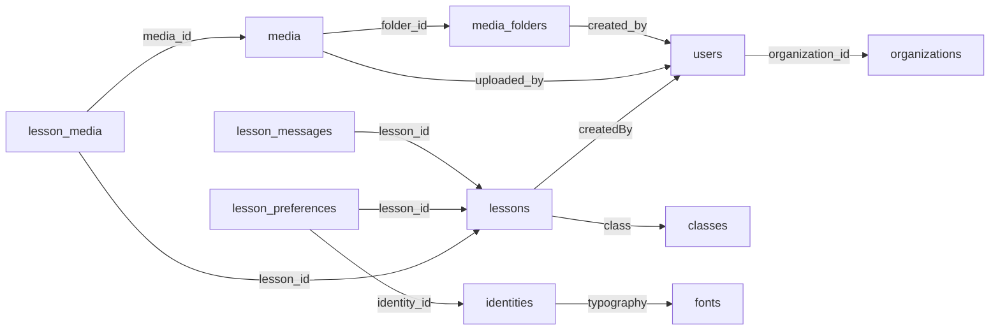
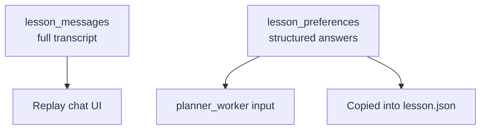
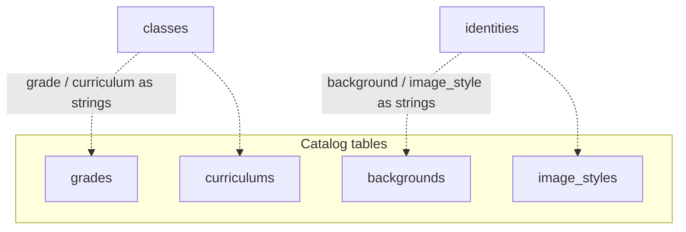
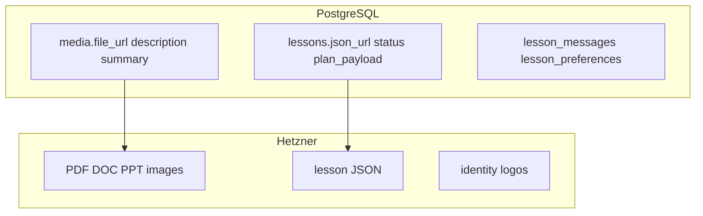

# 04 — PostgreSQL database

Base schema from Eraser, extended for **chat messages**, **lesson preferences**, and the new **lesson status** enum. Lookup tables (`grades`, `curriculums`, `backgrounds`, `image_styles`) are dropdown-only. Binaries live in Hetzner.

## Entity-relationship diagram

```mermaid
erDiagram
  ORGANIZATIONS ||--o{ USERS : has
  USERS ||--o{ MEDIA_FOLDERS : creates
  MEDIA_FOLDERS ||--o{ MEDIA : contains
  USERS ||--o{ MEDIA : uploads
  USERS ||--o{ LESSONS : creates
  CLASSES ||--o{ LESSONS : "used by"
  FONTS ||--o{ IDENTITIES : typography
  LESSONS ||--o{ LESSON_MESSAGES : has
  LESSONS ||--o| LESSON_PREFERENCES : has
  IDENTITIES ||--o{ LESSON_PREFERENCES : selected
  LESSONS }o--o{ LESSON_MEDIA : sources
  MEDIA ||--o{ LESSON_MEDIA : attached

  ORGANIZATIONS {
    string id PK
    string name
    string_array domains
    datetime created_at
    datetime updated_at
  }

  USERS {
    string id PK
    string name
    string email UK
    string password_hash
    string role
    string organization_id FK
    datetime created_at
    datetime updated_at
  }

  MEDIA_FOLDERS {
    string id PK
    string name
    string slug
    string created_by FK
    datetime created_at
    datetime updated_at
  }

  MEDIA {
    string id PK
    string folder_id FK
    string uploaded_by FK
    text description
    text summary
    string file_name
    string file_url
    string mime_type
    int file_size
    datetime created_at
    datetime updated_at
  }

  GRADES {
    string id PK
    string name
  }

  CURRICULUMS {
    string id PK
    string name
  }

  BACKGROUNDS {
    string id PK
    string name
  }

  IMAGE_STYLES {
    string id PK
    string name
  }

  FONTS {
    string id PK
    string name
    string url
  }

  CLASSES {
    string id PK
    string name
    string grade
    string curriculum
    string description
  }

  LESSONS {
    string id PK
    string title
    string createdBy FK
    datetime created_at
    datetime updated_at
    string json_url
    string class FK
    string status "see status enum"
    json plan_payload "optional planner output"
  }

  LESSON_MESSAGES {
    string id PK
    string lesson_id FK
    string role "user|assistant|system"
    text content
    json meta
    datetime created_at
  }

  LESSON_PREFERENCES {
    string lesson_id PK_FK
    string identity_id FK
    string class_id FK
    string topic
    string duration
    string_array learning_styles
    boolean pair_work
    boolean group_work
    string assessment
    string language
    string grade_hint
    json extra
    datetime updated_at
  }

  LESSON_MEDIA {
    string lesson_id FK
    string media_id FK
  }

  IDENTITIES {
    string id PK
    string name
    string primary_color
    string secondary_color
    string background
    string image_style
    string typography FK
    string instructions
    string logo
    boolean is_default
  }
```

## Lesson status enum

Stored on `lessons.status` (and mirrored in lesson JSON):

| Value | Meaning |
|-------|---------|
| `chatting` | Chat gathering requirements |
| `awaiting_plan_approval` | Ask user: continue chat or make plan |
| `planning` | Plan creation in progress |
| `awaiting_execute_approval` | Plan done; wait approve to build slides |
| `slides_in_progress` | Slides generating |
| `slides_ready` | Slides + lesson JSON done |
| `failed` | Error |

## Relationship summary



## Chat + selections (why both tables)



- **Messages** = conversational history (audit + UI).
- **Preferences** = normalized selections (pair_work, assessment, identity_id, …) used by planner/executer without re-parsing chat.

## Dropdown-only catalogs



## Where binaries live


