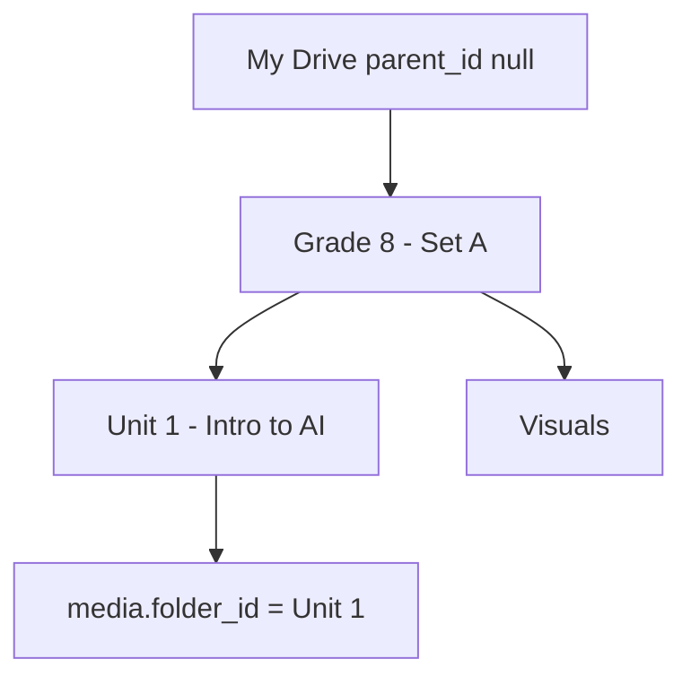
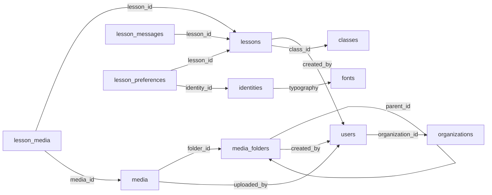
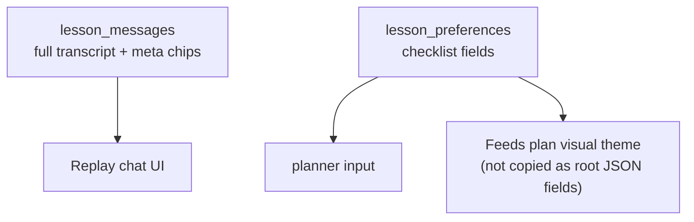
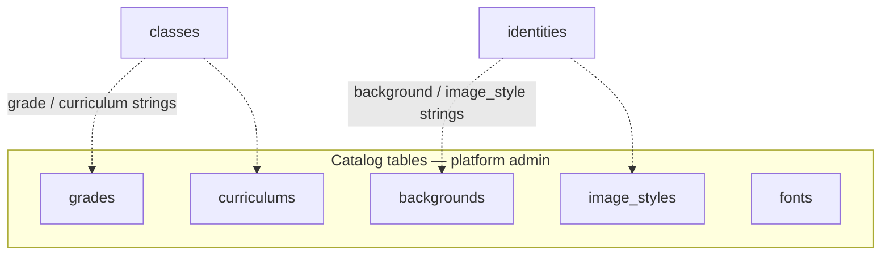
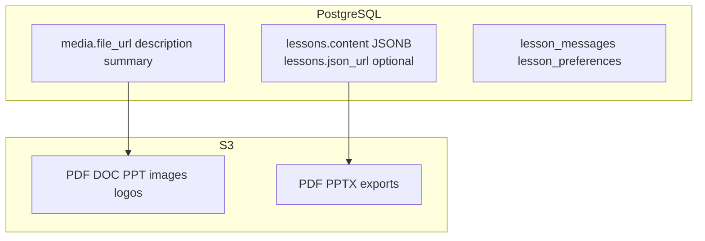

# 04 — PostgreSQL database

Base schema from `db-schema-eraser.md`, extended for **chat messages**, **lesson preferences**, **nested media folders**, and the **lesson status** enum. Lookup tables (`grades`, `curriculums`, `backgrounds`, `image_styles`) are dropdown-only. Binaries live in S3.

**Canonical lesson payload:** `lessons.content` JSONB (see [07-lesson-json-schema.md](07-lesson-json-schema.md)). Optional `json_url` for export artifacts.

## Entity-relationship diagram

```mermaid
erDiagram
  ORGANIZATIONS ||--o{ USERS : has
  ORGANIZATIONS ||--o{ MEDIA_FOLDERS : owns
  ORGANIZATIONS ||--o{ MEDIA : owns
  ORGANIZATIONS ||--o{ CLASSES : owns
  ORGANIZATIONS ||--o{ IDENTITIES : owns
  ORGANIZATIONS ||--o{ LESSONS : owns
  MEDIA_FOLDERS ||--o{ MEDIA_FOLDERS : "parent_id"
  MEDIA_FOLDERS ||--o{ MEDIA : contains
  USERS ||--o{ MEDIA_FOLDERS : creates
  USERS ||--o{ MEDIA : uploads
  USERS ||--o{ LESSONS : creates
  CLASSES ||--o{ LESSONS : "used by"
  FONTS ||--o{ IDENTITIES : typography
  LESSONS ||--o{ LESSON_MESSAGES : has
  LESSONS ||--o| LESSON_PREFERENCES : has
  IDENTITIES ||--o{ LESSON_PREFERENCES : selected
  LESSONS }o--o{ LESSON_MEDIA : sources
  MEDIA ||--o{ LESSON_MEDIA : attached

  ORGANIZATIONS {
    string id PK
    string name
    string_array domains
    datetime created_at
    datetime updated_at
  }

  USERS {
    string id PK
    string name
    string email UK
    string password_hash
    string role
    string organization_id FK
    datetime created_at
    datetime updated_at
  }

  MEDIA_FOLDERS {
    string id PK
    string organization_id FK
    string parent_id FK "nullable"
    string name
    string slug
    string created_by FK
    datetime created_at
    datetime updated_at
  }

  MEDIA {
    string id PK
    string organization_id FK
    string folder_id FK
    string uploaded_by FK
    string status
    text description
    text summary
    string file_name
    string file_url
    string mime_type
    int file_size
    int pages_number "nullable"
    text error "nullable"
    datetime created_at
    datetime updated_at
  }

  GRADES {
    string id PK
    string name
  }

  CURRICULUMS {
    string id PK
    string name
  }

  BACKGROUNDS {
    string id PK
    string name
  }

  IMAGE_STYLES {
    string id PK
    string name
  }

  FONTS {
    string id PK
    string name
    string url
  }

  CLASSES {
    string id PK
    string organization_id FK
    string name
    string grade
    string curriculum
    string description
  }

  LESSONS {
    string id PK
    string organization_id FK
    string title
    string created_by FK
    string class_id FK
    string identity_id FK "nullable"
    string status
    jsonb content
    string json_url "nullable export"
    json plan_payload "nullable legacy"
    datetime created_at
    datetime updated_at
  }

  LESSON_MESSAGES {
    string id PK
    string lesson_id FK
    string role "user|assistant|system"
    text content
    json meta
    datetime created_at
  }

  LESSON_PREFERENCES {
    string lesson_id PK_FK
    string identity_id FK
    string class_id FK
    string topic
    string duration
    string_array learning_styles
    string language
    string grade_hint
    json extra
    datetime updated_at
  }

  LESSON_MEDIA {
    string lesson_id FK
    string media_id FK
  }

  IDENTITIES {
    string id PK
    string organization_id FK
    string name
    string primary_color
    string secondary_color
    string background
    string image_style
    string typography FK
    string instructions
    string logo
    boolean is_default
  }
```

## Lesson status enum

Stored on `lessons.status` (mirrored in `lessons.content.status`):

| Value | Meaning |
|-------|---------|
| `chatting` | Chat gathering requirements |
| `awaiting_plan_approval` | Ask user: continue chat or make plan |
| `planning` | Plan creation in progress |
| `awaiting_execute_approval` | Plan done; wait approve to build slides |
| `slides_in_progress` | Slides generating |
| `slides_ready` | Slides done |
| `failed` | Error |

## Media status enum

| Value | Meaning |
|-------|---------|
| `uploading` | Upload in progress |
| `processing` | lesson-learner job running |
| `indexed` | Ready for lesson attachment |
| `failed` | Error (`media.error` set) |

## Nested media folders

| Concept | Rule |
|---------|------|
| Root | `media_folders.parent_id IS NULL` |
| Children | `WHERE parent_id = :folder_id` |
| Upload | Always into a folder — `media.folder_id NOT NULL` |
| Delete | Block if child folders or media exist (mock matches this) |
| Slug | `UNIQUE (organization_id, parent_id, slug)` |



## Relationship summary



## Chat + selections (why both tables)



- **Messages** = conversational history (audit + UI + interaction chips in `meta`).
- **Preferences** = normalized checklist used by planner/executer from DB.
- **Page activity types** live in `content.pages[].plan.type`, not preference booleans.

## Dropdown-only catalogs



Mock: `js/seed.js` → `grades`, `curriculums`, `backgrounds`, `image_styles`, `fonts`; managed in `admin/catalogs.html`.

## Where binaries live



## Mock data model (`js/seed.js` + `js/store.js`)

| Postgres table | Mock key |
|----------------|----------|
| `organizations` | `state.organizations` |
| `users` | `state.users` |
| `media_folders` | `state.folders` (with `parent_id`) |
| `media` | `state.media` |
| `identities` | `state.identities` |
| `classes` | `state.classes` |
| `lessons` | `state.lessons` |
| `lesson_messages` + preferences | `state.sessions[]` (embedded) |
| Catalogs | `grades`, `curriculums`, etc. |
| Platform admins | `state.platformAdmins` |

Persisted under `localStorage` key `xplain-teacher-mock-v1` (seed `version: 11`).
