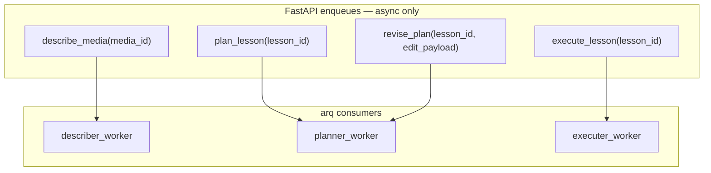
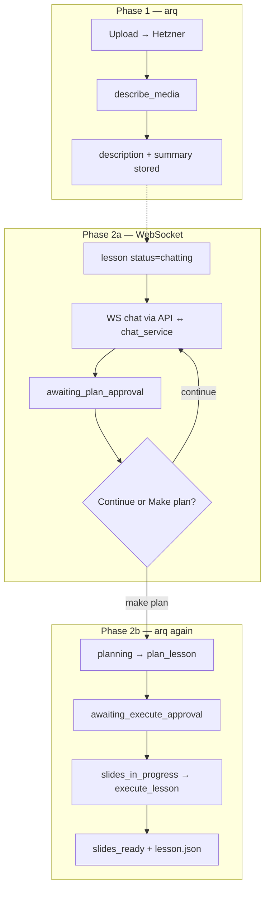
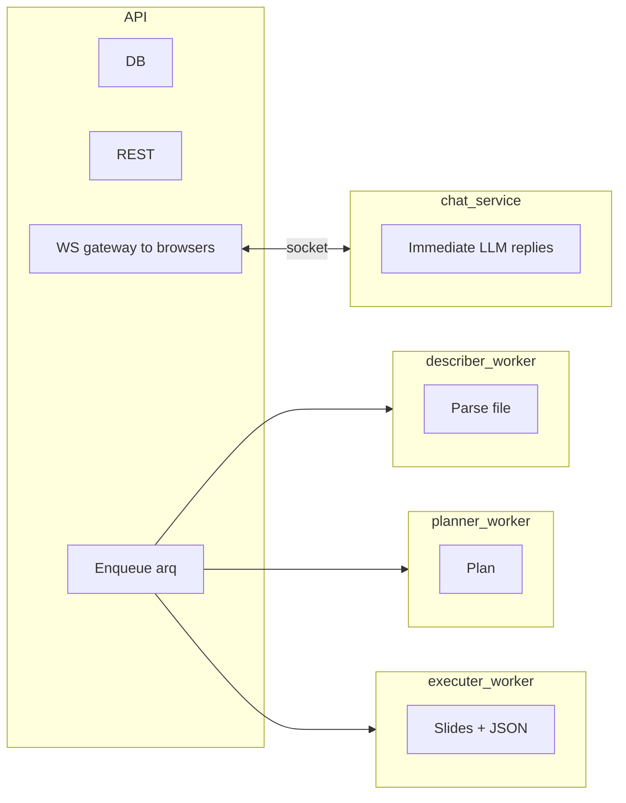
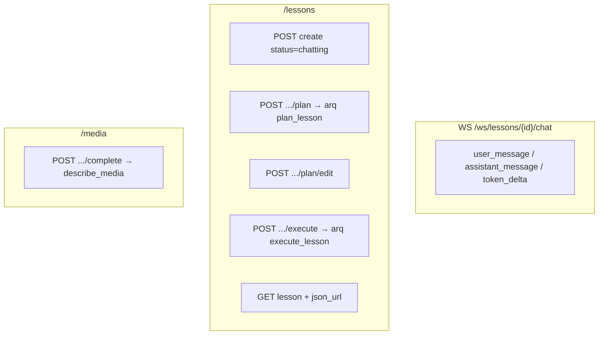
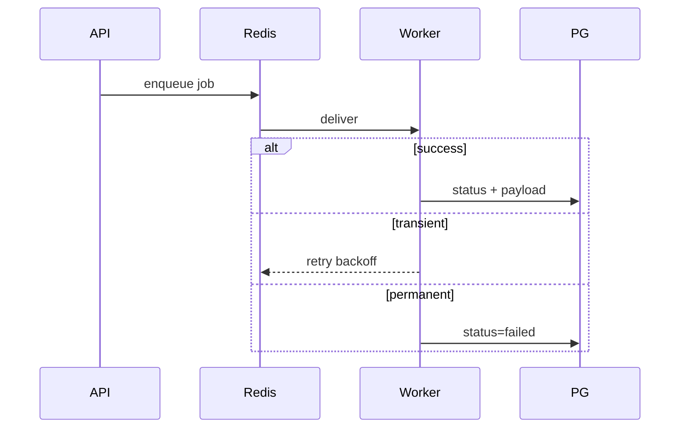

# 05 — Queue jobs & cross-service sequences

## arq job catalog

Chat is **not** an arq job — see [06-chat-service.md](06-chat-service.md) (WebSockets).

## Job → side effects

| Job | Worker | Reads | Writes |
|-----|--------|-------|--------|
| `describe_media` | describer | Hetzner file | `media.description`, `media.summary` |
| `plan_lesson` | planner | preferences + media text + identity | plan payload, status `awaiting_execute_approval` |
| `revise_plan` | planner | plan + edit | updated plan |
| `execute_lesson` | executer | plan + preferences + identity | lesson JSON, `json_url`, `slides_ready` |

| Real-time | Service | Transport |
|-----------|---------|-----------|
| Chat turns | `chat_service` | Frontend ↔ API WS ↔ chat_service WS |

## Full happy path

## Microservice ownership

## API surface (illustrative)

## Failure & retry (arq only)

