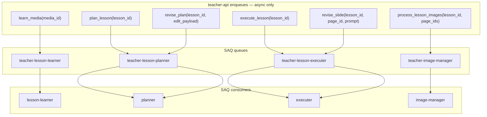
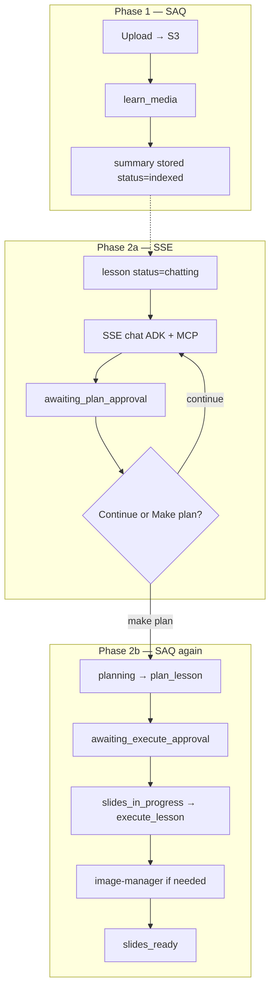
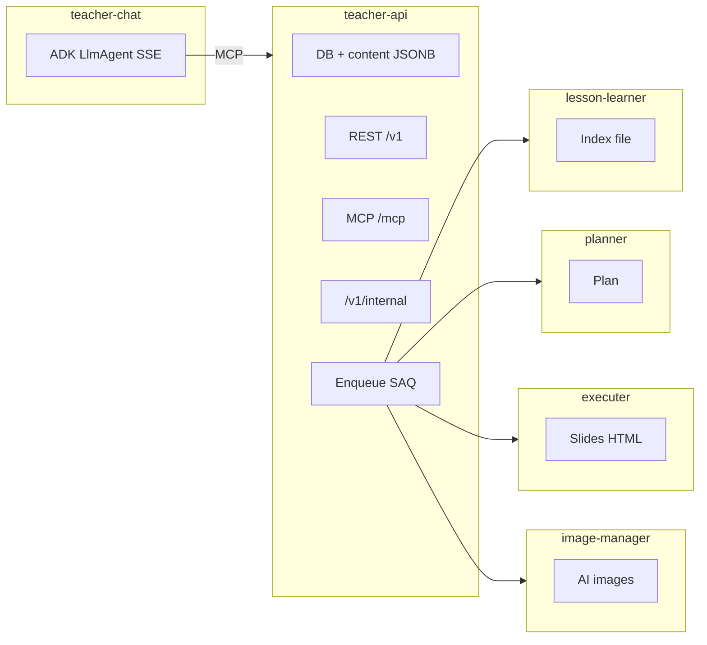
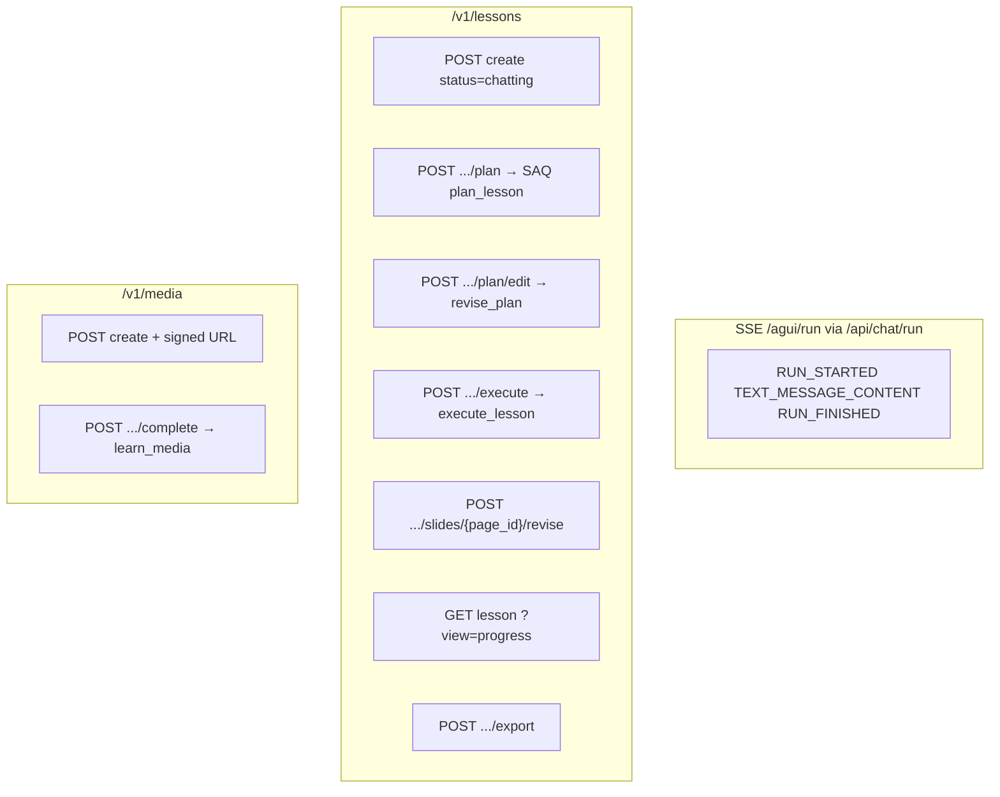
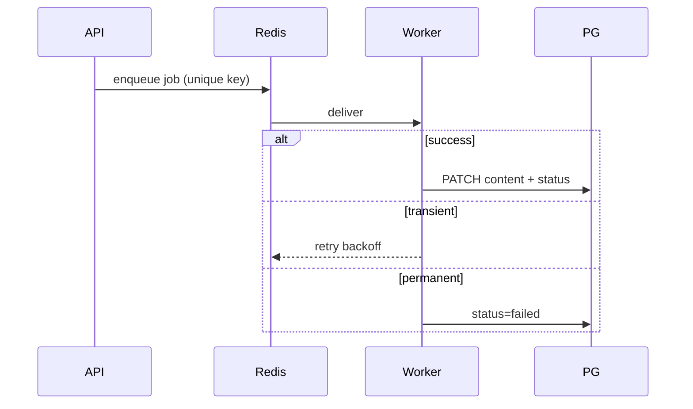

# 05 — Queue jobs & cross-service sequences

## SAQ job catalog

Chat is **not** an SAQ job — see [06-chat-service.md](06-chat-service.md) (SSE).

## Job → side effects

| Job | Worker | Reads | Writes |
|-----|--------|-------|--------|
| `learn_media` | lesson-learner | S3 file | `media.description`, `media.summary`, `status=indexed` |
| `plan_lesson` | planner | context (prefs + media + identity) | `content.plan`, `content.pages`, status `awaiting_execute_approval` |
| `revise_plan` | planner | plan + edit | updated plan |
| `execute_lesson` | executer | plan + prefs + identity | `content.lesson[]` HTML, status `slides_ready` |
| `revise_slide` | executer | page HTML + prompt | patched slide HTML |
| `process_lesson_images` | image-manager | image prompts | `generated_images_urls`, `images_status` |

| Real-time | Service | Transport |
|-----------|---------|-----------|
| Chat turns | teacher-chat | Frontend ↔ chat **SSE** (AG-UI); chat ↔ API **MCP** |

## Full happy path

## Microservice ownership

## API surface (illustrative)

## Failure & retry (SAQ)

### Stuck-job recovery

teacher-api runs a background loop (~60s) that re-enqueues lessons stuck in `planning` or `slides_in_progress` beyond configurable timeouts (default 180s).

## SAQ queue monitor

| Item | Value |
|------|--------|
| UI path | `/queues` on teacher-api |
| Health | `GET /queues/health` |
| Env | `REDIS_URL`, `PLANNER_REDIS_URL`, `EXECUTER_REDIS_URL`, `IMAGE_MANAGER_REDIS_URL` |
| Disable | `QUEUE_MONITOR_ENABLED=false` |

Queue names: `teacher-lesson-learner`, `teacher-lesson-planner`, `teacher-lesson-executer`, `teacher-image-manager`.

## Mock equivalent

No real queue — `js/media.js`, `js/chat.js`, and `js/workspace.js` use `setTimeout` / `async` delays to simulate worker progress. UI polls via `xplain:store` custom events (`js/store.js`).
