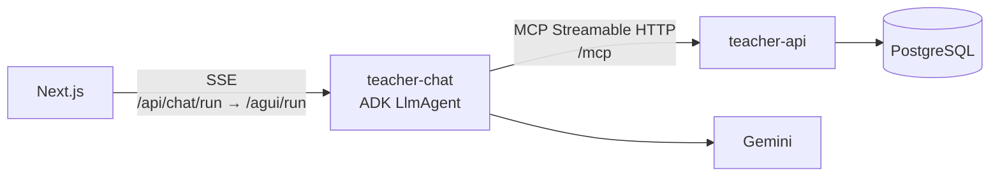
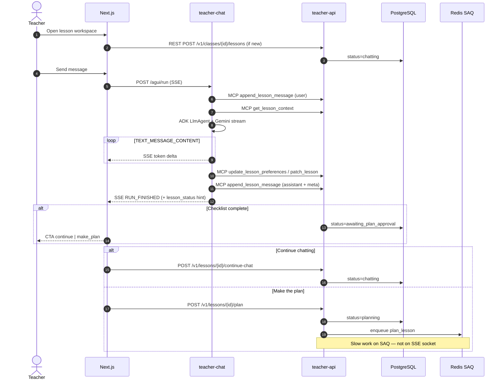
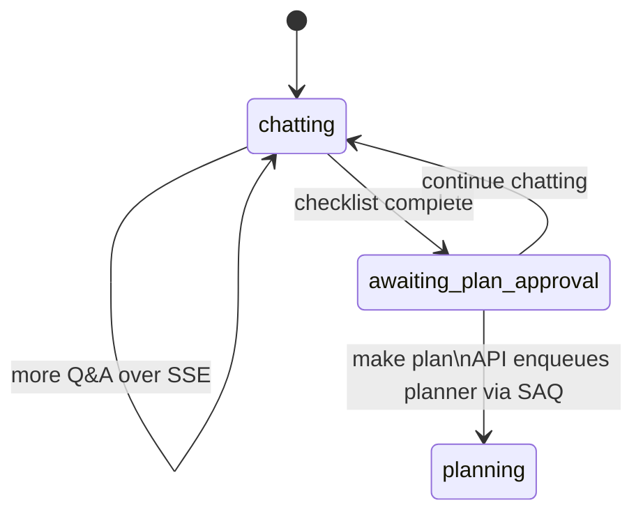

# 06 — Chat service (real-time SSE, not a worker)

## Why not SAQ?

Chat needs **immediate** streaming replies. Queuing a `chat_turn` job would add latency and feel broken in the UI.

So **chat is a long-running microservice** (`teacher-chat`), not an SAQ worker.

- **Frontend ↔ chat**: **SSE** (`POST /agui/run`, AG-UI protocol)
- **Chat ↔ API**: **MCP** Streamable HTTP (`/mcp`) + internal REST (`/v1/internal`)
- **lesson-learner / planner / executer / image-manager** stay on **SAQ** (slow, async jobs)

> **No WebSockets** in the production stack.

## Goal

1. Drive conversation to collect **full requirements** (checklist).
2. Persist every message + structured **user selections** in Postgres (via MCP tools / internal API).
3. When ready, ask: **continue chatting** or **make the plan**.
4. On **make the plan** → API sets status `planning` and **enqueues** planner (SAQ).
5. Uses **stored** `media.summary` only — never re-reads the file.

## Required checklist (before planning)

| Field | Description |
|-------|-------------|
| `topic` | Lesson subject/title |
| `media` | At least 1 indexed file attached |
| `identity_id` | Brand kit selected |
| `page_count` | Number of slides (≥ 1) |
| `duration_minutes` | Lesson length |
| `homework_style` | `none`, `end`, `per_page`, `group_work`, `assignments` |
| `image_style` | Visual style for generated images |

When complete → status moves to `awaiting_plan_approval`.

## Socket topology (SSE + MCP)

**Rule:** Browser talks to chat via SSE (proxied through Next.js). Chat calls API tools via MCP. Auth and tenancy stay on the API.

## Message flow (streaming)

## ADK agent (production)

| Item | Value |
|------|-------|
| Framework | Google ADK `LlmAgent` |
| Model | Gemini (`GEMINI_TEXT_MODEL`) |
| Tools | MCP on `teacher-api/mcp` |
| Tool filter | `get_lesson_context`, `append_lesson_message`, `update_lesson_preferences`, `patch_lesson`, `transition_lesson_status` |
| Grounding | `before_tool_callback` strips ungrounded preference fields |
| Visible text | Stream + persist strip `<execute_tool>`, tool dumps, and JSON fences — teachers never see machine artifacts |
| Interaction chips | Required on every question: trailing JSON `interaction` → `message.meta` (quick replies + free text) |
| Plan CTAs | UI shows **Make plan** / **Skip questions & make plan** / **Continue chatting** when status/checklist allow |
| History | Postgres `lesson_messages` (rehydrated each turn) |
| Concurrency | One run per lesson (409 if busy) |
| Rollback | `ADK_AGENT_ENABLED=false` → legacy `LessonAgent` |

## AG-UI SSE event types

| Event | Meaning |
|-------|---------|
| `RUN_STARTED` | Turn began |
| `TEXT_MESSAGE_START` | Assistant message started |
| `TEXT_MESSAGE_CONTENT` | Streaming text delta |
| `TEXT_MESSAGE_END` | Message complete |
| `RUN_FINISHED` | Turn done (+ optional `lesson_status`) |
| `RUN_ERROR` | Failure |

## What teacher-chat does vs API

| Responsibility | Owner |
|----------------|--------|
| Auth / lesson access check | API |
| Persist messages & preferences | API (via MCP tools) |
| LLM reply generation | **teacher-chat** (ADK) |
| Push reply to browser | chat → UI **SSE** |
| Enqueue plan/execute | API → SAQ |
| Read media file bytes | lesson-learner only |

## Chat vs workers

| Concern | Service | Transport | Immediate? |
|---------|---------|-----------|------------|
| Index upload | lesson-learner | SAQ | No |
| Gather requirements | **teacher-chat** | **SSE** | **Yes** |
| Build plan | planner | SAQ | No |
| Build slides | executer | SAQ | No |
| AI images | image-manager | SAQ | No |

## Status transitions from chat

## Mock implementation

`js/chat.js` simulates the agent without SSE:

| Mock `agent_step` | Production equivalent |
|-------------------|----------------------|
| `topic` | Gather topic |
| `source` | Attach indexed media |
| `identity` | Select identity |
| `details` | Duration, styles, assessment |
| `confirm` | awaiting_plan_approval CTA |
| `plan_ready` | awaiting_execute_approval |

Messages are appended to `session.messages[]`. **Create Lesson Plan** never auto-starts — teacher must click the CTA (matches production UX rule).
