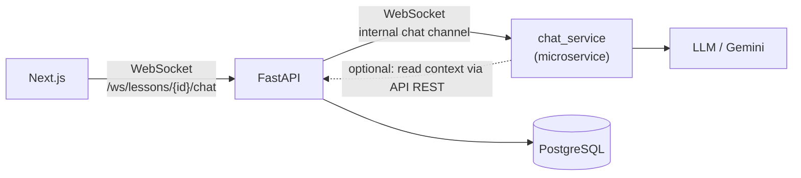
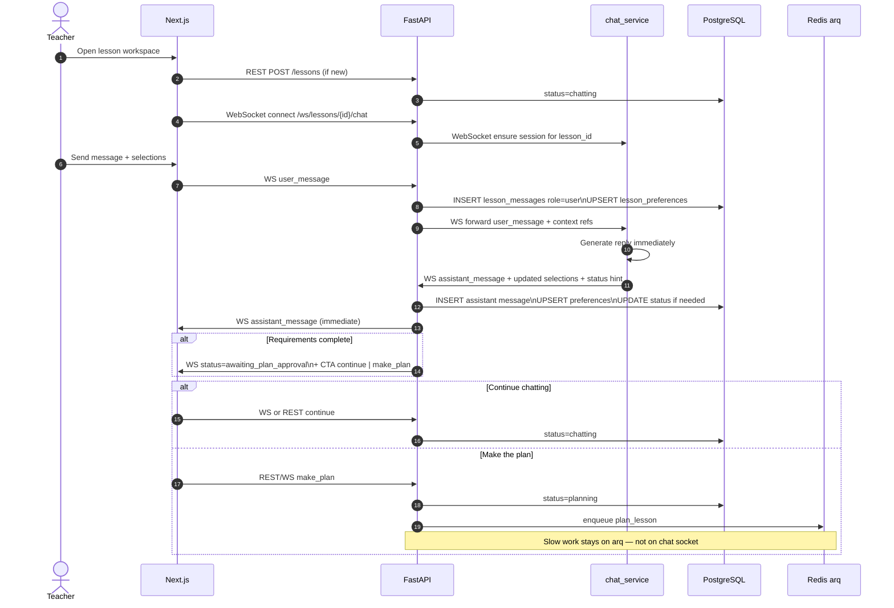
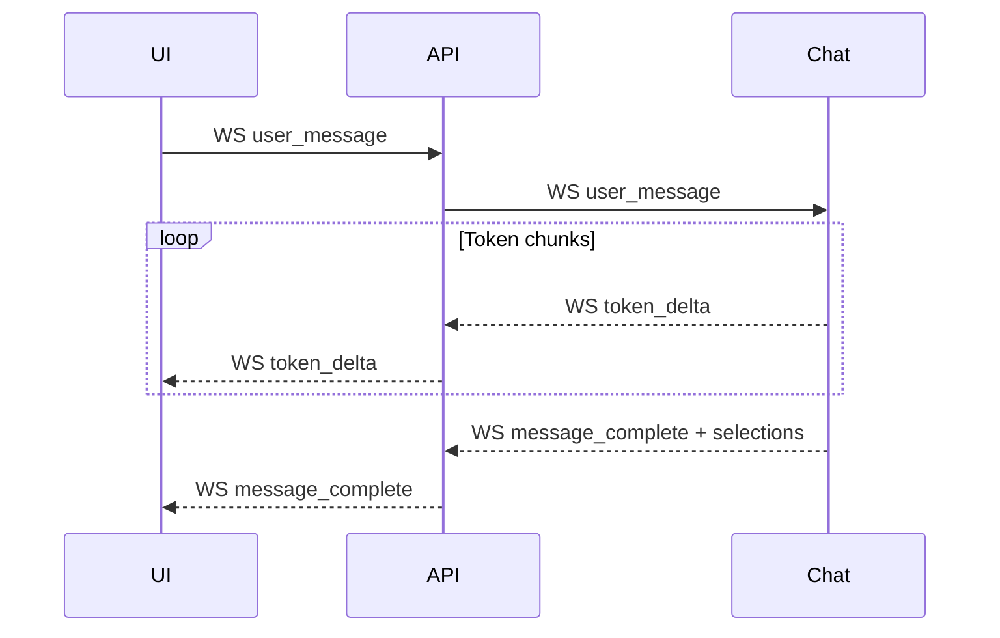
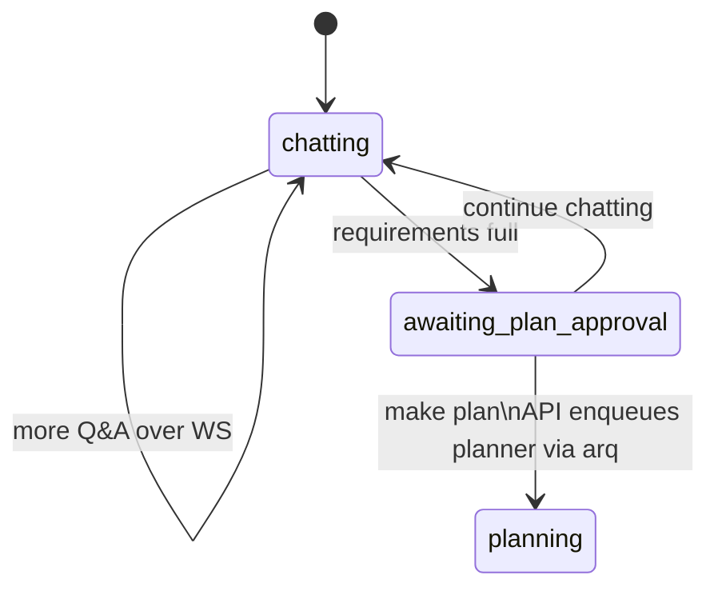

# 06 — Chat microservice (real-time, not a worker)

## Why not arq?

Chat needs **immediate** replies. Queuing a `chat_turn` job would add latency and feel broken in the UI.

So **chat is a long-running microservice**, not an arq worker.

- **Frontend ↔ API**: WebSocket (teacher sees messages live)
- **API ↔ Chat service**: WebSocket (or persistent socket) — API proxies / fans out; chat never talks to the browser directly
- **describer / planner / executer** stay on **arq** (slow, async jobs)

## Goal

1. Drive conversation to collect **full requirements**.
2. Persist every message + structured **user selections** in Postgres (via API or chat→API callbacks).
3. When ready, ask: **continue chatting** or **make the plan**.
4. On **make the plan** → API sets status `planning` and **enqueues** `planner_worker` (arq).
5. Uses **stored** `media.description` / `media.summary` only — never re-reads the file.

## Socket topology

**Rule:** Browser only opens a socket to the **API**. The API holds the socket to **chat_service**. That keeps auth, tenancy, and DB ownership on the API.

## Message flow (immediate)

## Streaming (optional)

## What chat_service does vs API

| Responsibility | Owner |
|----------------|--------|
| Auth / lesson access check | API |
| Persist messages & preferences | API (on each WS event) |
| LLM reply generation | **chat_service** |
| Push reply to browser | API → UI WebSocket |
| Enqueue plan/execute | API → arq |
| Read media file bytes | Neither (describer only) |

## Stored data (unchanged)

- `lesson_messages` — full transcript  
- `lesson_preferences` — pair_work, group_work, assessment, identity_id, media_ids, …  

See [04-database.md](04-database.md).

## Chat vs workers

| Concern | Service | Transport | Immediate? |
|---------|---------|-----------|------------|
| Learn upload | `describer_worker` | arq | No |
| Gather requirements | **`chat_service`** | **WebSocket** | **Yes** |
| Build plan | `planner_worker` | arq | No |
| Build slides | `executer_worker` | arq | No |

## Status transitions from chat

