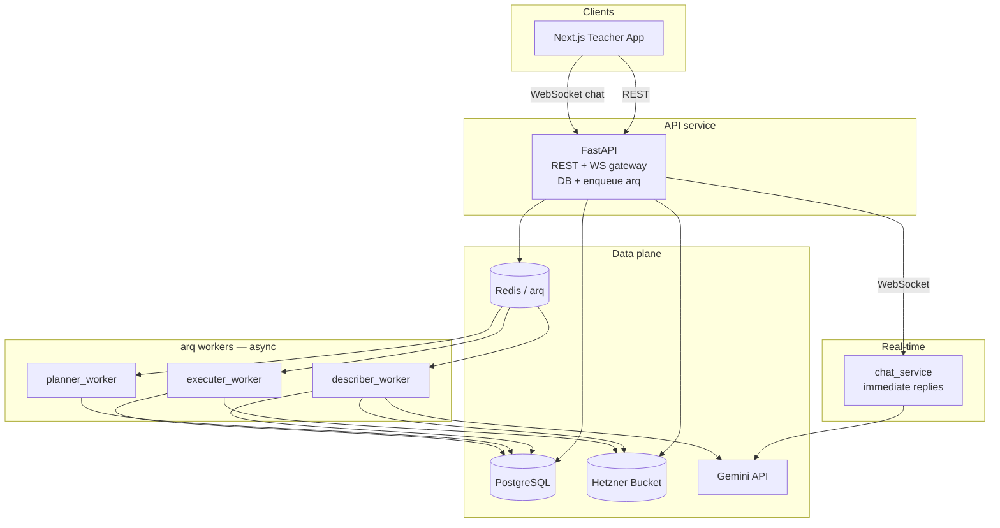
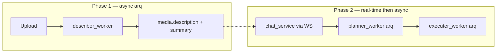
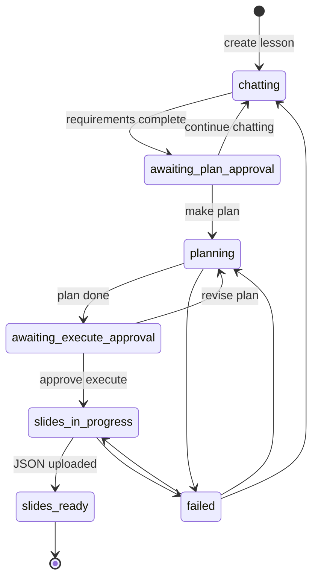

# Teacher Tools — Architecture Diagrams

This folder documents the **production** teacher-tools architecture (Next.js + FastAPI microservices + arq workers), mapped from the UX mock in this repo.

## Stack

| Layer | Choice |
|-------|--------|
| Frontend | Next.js |
| API | Python FastAPI (REST + **WebSocket** gateway + DB schema) |
| Real-time chat | **`chat_service` microservice** (WebSocket to API — **not** arq) |
| Queue | **arq** (Redis) for slow jobs only |
| Workers (arq) | `describer_worker`, `planner_worker`, `executer_worker` |
| Database | PostgreSQL |
| Object storage | Hetzner bucket |
| AI | Gemini (describer images + chat LLM as needed) |

## Microservices responsibilities

## Document index

| File | Contents |
|------|----------|
| [01-system-overview.md](01-system-overview.md) | System context, services |
| [02-media-describer-flow.md](02-media-describer-flow.md) | Upload → describer (async) |
| [03-lesson-planner-executor-flow.md](03-lesson-planner-executor-flow.md) | Plan / execute (async arq) |
| [04-database.md](04-database.md) | Postgres ER |
| [05-queue-and-sequence.md](05-queue-and-sequence.md) | arq jobs only |
| [06-chat-service.md](06-chat-service.md) | **WebSocket chat microservice** |
| [07-lesson-json-schema.md](07-lesson-json-schema.md) | **Full Hetzner lesson.json schema** |

## Design rules

1. **API owns** schema, REST, WebSocket to browsers, and arq enqueue.
2. **Chat is real-time**: Frontend WS → API → WS → `chat_service` → immediate reply path back.
3. **arq workers** only for slow work: describe file, build plan, build slides.
4. **Describe file ≠ chat** — store description/summary first; chat only reads them later.
5. On **make plan**, chat path ends the real-time gather phase; API sets `planning` and enqueues `planner_worker`.

## Critical separation: media ≠ chat

## Lesson status (DB + lesson JSON)

| Status | Meaning |
|--------|---------|
| `chatting` | Live chat gathering requirements |
| `awaiting_plan_approval` | Continue chat or make plan |
| `planning` | Plan job running (arq) |
| `awaiting_execute_approval` | Plan done; wait approve slides |
| `slides_in_progress` | Executer running (arq) |
| `slides_ready` | Done |
| `failed` | Error |

