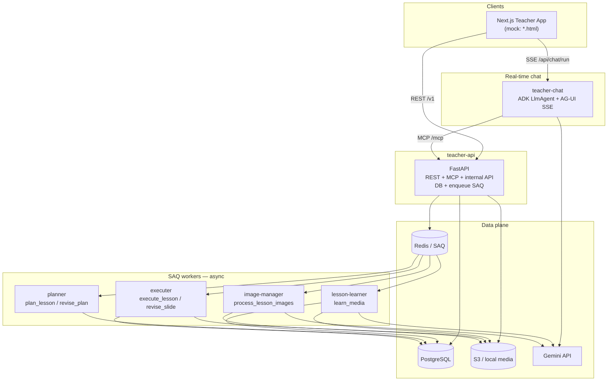
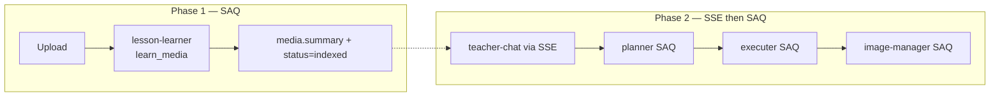
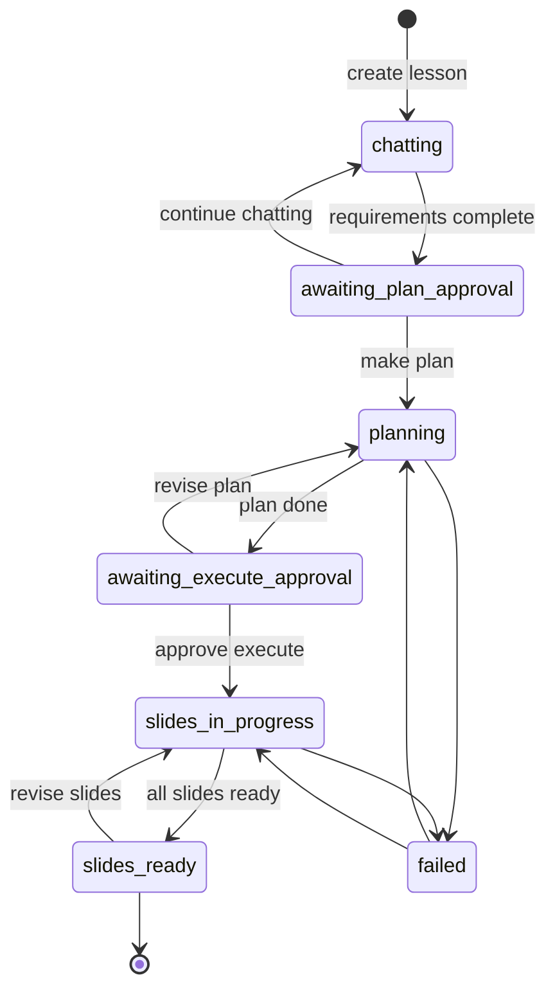

# Teacher Tools — Architecture Diagrams

This folder documents the **production** teacher-tools architecture (Next.js + FastAPI microservices + SAQ workers), mapped from the **UI mock** in this repo (`teacher-mock/`).

Canonical overview: [`/root/code/system_overview.md`](../../../system_overview.md) (full stack reference).

## Stack

| Layer | Choice |
|-------|--------|
| Frontend | Next.js (`getxplain-ai-teacher-frontend`) |
| API | Python FastAPI (`getxplain-ai-teacher-backend`) — REST, MCP, internal API, DB schema |
| Real-time chat | **`teacher-chat`** — Google ADK `LlmAgent` + **SSE** (AG-UI protocol) |
| Chat ↔ API tools | **MCP** Streamable HTTP on `teacher-api/mcp` |
| Queue | **SAQ** (Redis) for slow jobs |
| Workers (SAQ) | `lesson-learner`, `planner`, `executer`, `image-manager` |
| Database | PostgreSQL (`lessons.content` JSONB is canonical) |
| Object storage | S3 (or `LOCAL_MEDIA_DIR` in dev) |
| AI | Gemini (chat, plan, slides, images, media indexing) |
| Auth | WorkOS AuthKit JWT (teacher UI) |

## Repositories

| Service | Repository | Role |
|--------|------------|------|
| **teacher-api** | `getxplain-ai-teacher-backend` | REST, MCP, Postgres, job enqueue, export |
| **teacher-frontend** | `getxplain-ai-teacher-frontend` | Next.js UI |
| **teacher-chat** | `getxplain-ai-teacher-chat` | Requirements chat (ADK + MCP + SSE) |
| **teacher-planner** | `getxplain-ai-teacher-planner` | Plan generation + revision |
| **teacher-executer** | `getxplain-ai-teacher-excuter` | HTML slide generation + revision |
| **teacher-image-manager** | `getxplain-ai-teacher-image-manager` | AI images for slides |
| **teacher-lesson-learner** | *(separate deploy)* | Index uploaded PDFs/docs → summaries |

## UI mock in this repo

The mock is a **static HTML/CSS/JS** prototype — no backend, no LLM, no real uploads. State lives in browser `localStorage` (`xplain-teacher-mock-v1`, seed version **11**).

| Production concept | Mock implementation |
|--------------------|---------------------|
| Next.js app | `*.html` pages + `js/layout.js` shell |
| Postgres | `js/store.js` + `js/seed.js` |
| SSE chat (AG-UI) | `js/chat.js` scripted agent steps |
| SAQ workers | `js/workspace.js` timers (plan build, slide build) |
| lesson-learner | `js/media.js` mock indexing (`processing` → `indexed`) |
| S3 media | `data_url` previews in localStorage (trimmed on quota) |
| Platform admin | `admin/*.html` + `js/admin-layout.js` |

### Mock file map

```
teacher-mock/
├── index.html              # Home — create lesson, continue recent
├── login.html signup.html confirm-org.html
├── workspace.html          # Chat | plan | slides (main flow)
├── media.html              # Nested folder media library
├── identities.html classes.html class.html
├── lessons.html            # Session list
├── organization.html       # Org admin
├── settings.html
├── admin/                  # Platform admin (separate auth)
│   ├── dashboard.html organizations.html teachers.html catalogs.html
├── js/
│   ├── seed.js store.js    # Data model + persistence
│   ├── layout.js ui.js     # Shell, sidebar, components
│   ├── chat.js             # Mock requirement-gathering agent
│   ├── workspace.js        # Plan + slide generation simulation
│   ├── media.js media-picker.js
│   ├── identity-picker.js class-picker.js
│   └── admin-layout.js
├── css/app.css
├── docs/architecture/      # This folder
├── db-schema-eraser.md     # Postgres ER (paste into eraser.io)
└── system_overview.html    # Browsable architecture overview
```

## Microservices responsibilities



## Document index

| File | Contents |
|------|----------|
| [01-system-overview.md](01-system-overview.md) | System context, services, mock mapping |
| [02-media-describer-flow.md](02-media-describer-flow.md) | Upload → lesson-learner (`learn_media`) |
| [03-lesson-planner-executor-flow.md](03-lesson-planner-executor-flow.md) | Plan / execute / revise (SAQ) |
| [04-database.md](04-database.md) | Postgres ER + nested media folders |
| [05-queue-and-sequence.md](05-queue-and-sequence.md) | SAQ jobs + cross-service sequences |
| [06-chat-service.md](06-chat-service.md) | **SSE chat** (ADK + MCP) |
| [07-lesson-json-schema.md](07-lesson-json-schema.md) | **`lessons.content` JSON schema** |

## Design rules

1. **API owns** schema, REST, MCP, internal routes, and SAQ enqueue.
2. **Chat is real-time via SSE** (AG-UI): Frontend → chat service; agent tools call API via MCP.
3. **SAQ workers** only for slow work: index media, build plan, build slides, generate images.
4. **Index media ≠ chat** — store description/summary first; chat only reads them later.
5. On **make plan**, chat turn ends the gather phase; API sets `planning` and enqueues planner.
6. **Postgres `lessons.content` is canonical** — workers patch incrementally via internal API.

## Critical separation: media ≠ chat



## Lesson status (DB + lesson content JSON)

| Status | Meaning |
|--------|---------|
| `chatting` | Live chat gathering requirements |
| `awaiting_plan_approval` | Continue chat or make plan |
| `planning` | Plan job running (SAQ) |
| `awaiting_execute_approval` | Plan done; wait approve slides |
| `slides_in_progress` | Executer running (SAQ) |
| `slides_ready` | Done |
| `failed` | Error |


